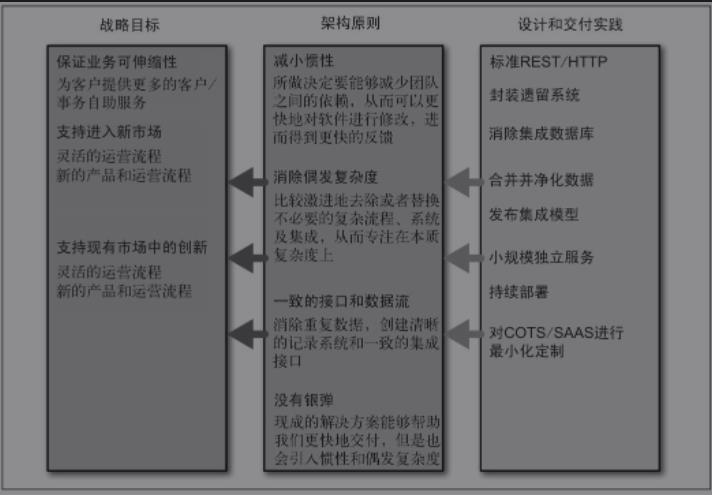

# 《微服务设计》笔记

微服务是一种分布式系统解决方案，推动细粒度服务的使用，这些服务协同工作，且每个服务都有自己的生命周期。微服务主要围绕业务领域建模，避免了由传统的分层架构引发的很多问题。

- [《微服务设计》笔记](#微服务设计笔记)
  - [微服务](#微服务)
    - [什么是微服务](#什么是微服务)
      - [很小并专注于一件事](#很小并专注于一件事)
      - [自治性](#自治性)
    - [主要好处](#主要好处)
      - [技术异构性](#技术异构性)
      - [弹性](#弹性)
      - [扩展](#扩展)
      - [简化部署](#简化部署)
      - [与组织结构相匹配](#与组织结构相匹配)
      - [可组合性](#可组合性)
      - [对可替代性的优化](#对可替代性的优化)
    - [面向服务的架构](#面向服务的架构)
    - [其他分解技术](#其他分解技术)
      - [共享库](#共享库)
      - [模块](#模块)
    - [没有银弹](#没有银弹)
  - [演化式架构师](#演化式架构师)
    - [架构师的演化视角](#架构师的演化视角)
    - [分区](#分区)
    - [制定规则](#制定规则)
      - [原则](#原则)
      - [实践](#实践)
    - [要求的标准](#要求的标准)
      - [服务监控](#服务监控)
      - [接口](#接口)
      - [架构安全性](#架构安全性)
    - [代码治理](#代码治理)
      - [范例](#范例)
      - [裁剪服务代码模板](#裁剪服务代码模板)
    - [技术债务](#技术债务)
    - [例外管理](#例外管理)
    - [集中治理和领导](#集中治理和领导)
  - [如何建模服务](#如何建模服务)
    - [好服务的标准](#好服务的标准)
      - [松耦合](#松耦合)
      - [高内聚](#高内聚)
    - [限界上下文](#限界上下文)
      - [共享的隐藏模型](#共享的隐藏模型)
      - [模块和服务](#模块和服务)
    - [业务功能](#业务功能)
    - [逐步划分上下文](#逐步划分上下文)
    - [关于业务概念的沟通](#关于业务概念的沟通)
  - [集成](#集成)
    - [寻找理想的集成技术](#寻找理想的集成技术)
      - [避免破坏性修改](#避免破坏性修改)
      - [保证API的技术无关性](#保证api的技术无关性)
      - [易用性](#易用性)
      - [隐藏内部实现细节](#隐藏内部实现细节)
    - [为用户创建接口](#为用户创建接口)
    - [共享数据库](#共享数据库)
    - [同步与异步](#同步与异步)
    - [编排与协同](#编排与协同)
    - [远程过程调用](#远程过程调用)
      - [技术的耦合](#技术的耦合)
      - [本地调用与远程调用并不相同](#本地调用与远程调用并不相同)
      - [脆弱性](#脆弱性)
      - [RPC总结](#rpc总结)
    - [REST](#rest)
      - [REST和HTTP](#rest和http)
      - [超媒体作为程序状态的引擎](#超媒体作为程序状态的引擎)
      - [JSON/XML/其他](#jsonxml其他)
      - [基于HTTP的REST的缺点](#基于http的rest的缺点)
    - [实现基于事件的异步协作方式](#实现基于事件的异步协作方式)
      - [异步架构的复杂性](#异步架构的复杂性)
    - [服务即状态机](#服务即状态机)
    - [响应式扩展](#响应式扩展)
    - [DRY和代码重用的危险](#dry和代码重用的危险)
    - [按引用访问](#按引用访问)
    - [版本管理](#版本管理)
      - [尽可能不要做破坏性修改](#尽可能不要做破坏性修改)
      - [尽可能及早发现破坏性修改](#尽可能及早发现破坏性修改)
      - [使用语义化的版本管理](#使用语义化的版本管理)
      - [不同的接口共存](#不同的接口共存)
      - [同时使用多个版本的服务](#同时使用多个版本的服务)
    - [用户界面](#用户界面)
    - [与第三方软件集成](#与第三方软件集成)
  - [分解单块系统](#分解单块系统)
    - [关键是接缝](#关键是接缝)
    - [分解](#分解)
    - [分解的原因](#分解的原因)
      - [杂乱的依赖](#杂乱的依赖)
    - [数据库的处理](#数据库的处理)
      - [打乱外键关系](#打乱外键关系)
      - [共享静态数据](#共享静态数据)
      - [共享动态数据](#共享动态数据)
      - [共享表](#共享表)
      - [重构数据库](#重构数据库)
    - [事务边界](#事务边界)
    - [报表](#报表)
      - [通过服务调用来获取数据](#通过服务调用来获取数据)
      - [数据导出](#数据导出)
      - [事件数据导出](#事件数据导出)
    - [修改的代价](#修改的代价)
  - [部署](#部署)
    - [持续集成](#持续集成)
    - [把持续集成映射到微服务](#把持续集成映射到微服务)
    - [构建流水线和持续交付](#构建流水线和持续交付)
    - [平台特定的构建物](#平台特定的构建物)
    - [定制化镜像](#定制化镜像)
      - [将镜像作为构建物](#将镜像作为构建物)
      - [不可变服务器](#不可变服务器)
    - [环境](#环境)
    - [服务配置](#服务配置)
    - [服务与主机之间的映射](#服务与主机之间的映射)
      - [单主机多服务](#单主机多服务)
      - [应用程序容器](#应用程序容器)
      - [每个主机一个服务](#每个主机一个服务)
      - [平台即服务（PaaS）](#平台即服务paas)
    - [自动化](#自动化)
      - [从物理机到虚拟机](#从物理机到虚拟机)
      - [Docker](#docker)
    - [一个部署接口](#一个部署接口)
    - [部署小结](#部署小结)
  - [测试](#测试)
    - [测试类型](#测试类型)
    - [测试范围](#测试范围)
      - [单元测试](#单元测试)
      - [服务测试](#服务测试)
      - [端到端的测试](#端到端的测试)
      - [权衡](#权衡)
      - [比例](#比例)
    - [实现服务测试](#实现服务测试)
      - [打桩和mock](#打桩和mock)
    - [端到端测试](#端到端测试)
      - [谁来写测试](#谁来写测试)
      - [测试时间](#测试时间)
      - [大量的堆积](#大量的堆积)
      - [元版本](#元版本)
      - [测试场景，而不是故事](#测试场景而不是故事)
      - [消费者驱动测试](#消费者驱动测试)
      - [端到端测试有关的权衡](#端到端测试有关的权衡)
    - [部署后测试](#部署后测试)
      - [区分部署和上线](#区分部署和上线)
      - [金丝雀发布](#金丝雀发布)
      - [平均故障时间和平均修复时间](#平均故障时间和平均修复时间)
    - [跨功能测试](#跨功能测试)
  - [监控](#监控)
    - [不同配置需要考虑的问题](#不同配置需要考虑的问题)
      - [单一服务，单一主机](#单一服务单一主机)
      - [单一服务，多个主机](#单一服务多个主机)
      - [多个服务，多个主机](#多个服务多个主机)
    - [日志处理](#日志处理)
    - [指标追踪](#指标追踪)
    - [服务指标](#服务指标)
    - [综合监控](#综合监控)
    - [关联标识](#关联标识)
    - [级联](#级联)
    - [标准化](#标准化)
    - [考虑受众](#考虑受众)
    - [未来](#未来)
    - [监控小结](#监控小结)
  - [安全](#安全)
    - [身份验证和授权](#身份验证和授权)
      - [常见的单点登录实现](#常见的单点登录实现)
      - [单点登录网关](#单点登录网关)
      - [细粒度的授权](#细粒度的授权)
    - [服务间的身份验证和授权](#服务间的身份验证和授权)
      - [代理问题](#代理问题)
    - [静态数据的安全](#静态数据的安全)
      - [使用众所周知的加密算法](#使用众所周知的加密算法)
      - [一些数据加密的准则](#一些数据加密的准则)
    - [深度防御](#深度防御)
    - [内建安全](#内建安全)
  - [康威定律和系统设计](#康威定律和系统设计)
    - [适应沟通途径](#适应沟通途径)
    - [服务所有权](#服务所有权)
    - [共享服务的原因](#共享服务的原因)
    - [内部开源](#内部开源)
    - [限界上下文和团队结构](#限界上下文和团队结构)
  - [规模化微服务](#规模化微服务)
    - [故障无处不在](#故障无处不在)
    - [功能降级](#功能降级)
    - [架构性安全措施](#架构性安全措施)
    - [反脆弱的组织](#反脆弱的组织)
      - [超时](#超时)
      - [断路器](#断路器)
      - [舱壁](#舱壁)
      - [隔离](#隔离)
    - [幂等](#幂等)
    - [扩展系统](#扩展系统)
      - [更强的主机](#更强的主机)
      - [拆分负载](#拆分负载)
      - [分散风险](#分散风险)
      - [负载均衡](#负载均衡)
      - [基于worker的系统](#基于worker的系统)
      - [重新设计](#重新设计)
    - [扩展数据库](#扩展数据库)
      - [服务可用性和数据持久性](#服务可用性和数据持久性)
      - [扩展读取](#扩展读取)
      - [扩展写](#扩展写)
      - [共享数据库基础设施](#共享数据库基础设施)
      - [CQRS](#cqrs)
    - [缓存](#缓存)
    - [自动伸缩](#自动伸缩)
    - [CAP定理](#cap定理)
    - [服务发现](#服务发现)
    - [文档服务](#文档服务)
    - [自描述系统](#自描述系统)
  - [总结](#总结)
    - [微服务的原则](#微服务的原则)
    - [箴言](#箴言)

## 微服务

一些概念：领域驱动设计、持续交付、按需虚拟化、基础设施自动化、小型自治团队、大型集群系统

### 什么是微服务

#### 很小并专注于一件事

在一个单块系统内，通常会创建一些抽象层或模块来保证代码的内聚性，“把因相同原因而变化的东西聚合到一起，把因不同原因而变化的东西分离开来”。微服务将这个理念应用在独立的服务上，根据业务的边界来确定服务的边界，可以很容易的确定某个功能代码应该放在哪里，同时避免代码库过大的问题。

代码库的大小：一个经验法则，一个微服务应该可以在两周内完全重写。还有一个角度是，该服务能否很好地与团队结构匹配。

服务越小，微服务架构的优点和缺点也越明显，独立性带来的好处越多，但管理大量服务也会越复杂。

#### 自治性

一个微服务是一个独立的实体，它可以独立的部署在PAAS(Platform As A Service)上，也可以作为一个操作系统进程存在。尽量避免把多个服务部署在同一台机器上，可以大大简化分布式系统的构建。

服务之间通过网络调用进行通信，加强了服务之间的隔离性，避免紧耦合。服务可以独立进行修改，并且一个服务的部署不应该引起该服务消费方的变动。

对于一个服务，应该考虑什么应该暴露，什么应该隐藏。暴露的过多会产生耦合降低自治性。服务暴露出API，服务之间通过API进行通信。API的实现技术应该避免与消费方耦合，所以应该选择与具体技术不相关的API实现方式。

法则：应该能修改一个服务并对其进行部署，而不影响其他任何服务。

### 主要好处

#### 技术异构性

在一个由多个服务相互协作的系统中，可以在不同的服务中使用最适合该服务的技术。

微服务技术可以帮助我们更快的采用新技术，并理解新技术的好处。对单块系统来说，新的技术会对整个系统产生巨大影响。而微服务系统可以选择一个风险最小的服务来采用新技术。

贯穿本书的问题：微服务如何寻找平衡。

#### 弹性

服务边界是一个很显然的舱壁：如果系统中的一个组件不可用了，但是并没有导致级联故障，那么系统的其他部分还可以正常运行。

单块系统可以通过将同样的实例运行在不同的机器上来降低功能完全不可用的概率，而微服务系统本身就能很好处理服务不可用和功能降级的问题。

微服务系统可以改进弹性，但仍需要谨慎对待，一旦使用了分布式系统，网络就会是个问题。

#### 扩展

单块服务只能作为一个整体进行拓展，即使系统中只有一小部分存在性能问题，也要对整个服务进行拓展。

如果使用较小的多个服务，则可以只对需要扩展的服务进行扩展。可以把不需要扩展的服务运行在更小的、性能稍差的硬件上。

#### 简化部署

在代码量很大的单块程序中，即使只修改了一行代码，也要重新部署整个应用程序，部署的风险导致实际操作中部署的频率会变得很低，两次发布之间可能做了很多改动，但最后一刻才一次性发布到生产环境，但两次发布的差异越大，出错的可能性也越大。

在微服务架构中，各个服务的部署是独立的，可以更快对特定代码进行部署。发生问题也更容易回滚。

#### 与组织结构相匹配

小型代码库上工作的小团队会更加高效，微服务架构可以更好的将架构与组织结构相匹配，获得理想的团队大小和生产力。

#### 可组合性

在微服务架构中，可以根据不同目的，通过不同方式使用同一种功能。我们需要考虑的应用程序种类可能包括Web、原生应用、移动端Web、平板应用和可穿戴设备等，针对每一种都应该考虑如果对已有功能进行组合来实现这些应用。

在微服务架构中系统开放很多接口供外部使用。情况改变时可以用不同的方式构建应用。

#### 对可替代性的优化

使用多个小规模服务时，重新实现某一个服务或直接删除服务都是很容易操作的。而单块系统中这样做的风险非常高。

### 面向服务的架构

SOA(Service-Oriented Architecture)，其中包含多个服务，服务之间通过配合提供一系列功能。一个服务通常以独立形式存在于操作系统，服务之间通过网络调用，而非进程内调用的方式进行通信。

实施SOA会遇到这些问题：通信协议的选择，第三方中间件的选择，服务粒度的确定等。微服务架构是SOA的一种特定方法。

### 其他分解技术

#### 共享库

基本上所有的语言都支持将整个代码库分解成多个库，这是一种非常标准的分解技术。这些库可以由第三方或自己的组织提供，不同的团队和服务通过库的形式共享功能。

但是这种方式存在一些缺点：无法选择异构的技术；失去独立地对系统某一部分进行扩展的能力；除非使用动态链接库，否则每次库有更新都要重新部署整个进程，无法独立部署变更；缺乏明显的接缝来建立架构的安全保护措施，无法确保系统的弹性。

#### 模块

有点语言提供了模块分解技术，允许对模块进行生命周期管理，可以把模块部署到运行的进程中，并且在不停止整个进程的前提下对某个模块进行修改。

OSGI最初是Eclipse Java IDE使用的一种安装插件的方式，而现在很多项目都在使用库对JAVA模块化。但OSGI非常强调诸如模块生命周期管理之类的事，而语言本身对此并没有足够的支持，迫使模块作者做更多的工作进行模块隔离，在一个进程内也容易使模块过度耦合。

Erlang采用了不同的方式，模块的概念内嵌在Erlang语言的运行时中，可以对Erlang的模块进行停止、重启或升级等操作而不会有任何问题。但它也存在共享库类似的缺点。

还有一个值得注意地事情：在一个单块进程中创建隔离性很好的模块是可能的，但很少有人能真正做到，代码会迅速耦合在一起。而进程边界的存在能有效避免这种情况，尽管这并不是使用进程隔离的主要原因。

### 没有银弹

微服务不是免费的午餐，更不是银弹。选择微服务需要面对多有分布式系统需要面对的复杂性，要在部署、测试、监控等方面做很多工作，考虑如何扩展系统并保证它的弹性，甚至处理分布式事务、CAP相关的问题。

## 演化式架构师

### 架构师的演化视角

软件中我们会遇到大量的需求变更，架构师必须改变从一开始就要设计出完美产品的想法，相反应该设计一个合理的框架，在框架下慢慢的演化出正确的系统。

系统的使用者不仅是终端用户，还有工作在其上的开发运维人员，他们也对系统的需求变更负责。

架构师应该专注在大方向上，只在很有限的情况下参与到非常具体的细节实现中来。

### 分区

将架构师比作城市规划师，区域的概念对应服务边界，或者是粗粒度的服务群组。架构师应该少关注区域内的事情，多关注区域之间的事情，考虑不同的服务之间如何交互，或者保证能够对整个系统的健康状态进行监控。

在区域之间，或者说架构图中的框图之间，要非常小心，这些地方的错误会很难纠正。

代码架构师需要理解他们的决定会对系统造成怎样的影响。最低的要求是，架构师要花时间和团队在一起工作，理想情况下他们应该一起编码。

### 制定规则

#### 原则

为了和更大的目标保持一致，会制定一些具体的规则，这些规则并不是一成不变的。

一般来讲，原则最好不要超过10个，原则越多，发生重叠和冲突的可能性就越大。

#### 实践

通过相应的实践来保证原则能够得到实施，通常实践是技术相关的，而且是比较底层的。

实践应该巩固原则。

### 要求的标准

在优化单个服务自治性的同时，也要兼顾全局。一种能实现平衡的方法就是，清楚地定义出一个好服务应有的属性。

#### 服务监控

能够清晰地描绘出跨服务系统的健康状态非常关键，这必须在系统级别而非单个服务级别进行考虑。

建议所有的服务使用相同的方式报告健康状态及其监控相关的数据。可能会选择推送机制，每个服务主动把数据推送到某个集中的位置，或者使用轮询系统来从各个节点收集数据。但无论选择是什么，都应该尽量保持标准化。

不要为了服务的具体实现而改变监控系统。日志功能和监控的情况类似，也需要集中式管理。

#### 接口

选用少数几种明确的接口技术有助于新消费者的集成，但选用太多不同的集成技术就很糟糕。

#### 架构安全性

保证每个服务都可以应对下游服务的错误请求，否则系统就会很脆弱。

对以下几种请求做不同处理可以帮助系统及时失败并且有利于追溯问题：正常且被正确处理的请求；错误请求，并且服务识别出他是错的，但什么也没做；被访问服务宕机，无法判断请求是否正常。

### 代码治理

达成共识是一个好主意，但如何保证各个服务中遵守共识就比较麻烦。比较奏效的两种方式是：提供范例和服务代码模板

#### 范例

如果在系统中人们有比较好的代码范例可以模仿，那他们也不会错的很离谱

理想情况下，范例应该来自真实项目，而不是专门实现的一个例子。

#### 裁剪服务代码模板

针对自己的开发实践裁剪出一个服务代码模板，可以提高开发速度和保证代码质量。

创建服务代码模板不是某个中心化工具的职责，也不是指导工作的架构团队的职责，应该通过合作方式定义出这些实践。

如果你决定要使用一个裁剪的服务代码模板，一定要想清楚它的职责是什么，过多的功能加入会让框架变得不堪重负。

如果要强制使用，一定要确定它能简化开发人员的工作，而不是使其复杂化。

重用代码可能会引入服务间的耦合。如果手动把服务代码模板复制到各个服务中，如果核心服务代码模板升级，需要很长时间才能把更新应用到各个服务；如果简单的做成一个共享的库依赖，就要小心系统过度耦合。

### 技术债务

有时为了发布一些紧急的特性，可能无法完全遵守技术愿景，或者有时系统的目标会发生变化，并且与现有的实现不服，就会产生技术债务。

理解债务的层次及其对系统的影响非常重要，一种比较结构化的方式是维护一个债务列表，然后定期回顾。

### 例外管理

原则和实践可以指导我们如何构建系统，但有时我们可能会针对某个规则破一次例，然后记录下来，如果这样的例外出现了很多次，就可以通过修改原则和实践的方式把我们的理解固化下来。

### 集中治理和领导

治理：通过评估干系人的需求、当前情况及下一步的可能性来确保企业目标的达成，通过排优先级和做决策来设定方向。对于已经达成一致的方向和目标进行监督。

架构师承担技术治理的职责。需要确保有一组指导开发的原则，这些原则与组织的战略相符，并且以这些原则为指导衍生出的实践不会给开发人员带来痛苦；需要了解新技术；需要知道在什么时候做出怎样的取舍，还要让同事也理解这些决定和取舍。

一般来讲，治理是一个小组活动，架构师领导并且每个交付团队都有人参加，架构师负责确保组织的正常运作，整个小组对治理负责。

## 如何建模服务

### 好服务的标准

两个重要的概念是：松耦合和高内聚

#### 松耦合

如果做到松耦合，修改一个服务就不用修改另一个服务，这非常重要。

一个松耦合的服务应该尽可能少地知道与之协作的那些服务的信息。应该限制两个服务之间不同调用形式的数量，过度通信会导致紧耦合。

#### 高内聚

把相关的行为聚集在一起，这样可以只在一个地方进行修改，否则需要发布多个微服务才能交付这个功能。在多个不同的地方修改会很慢并且部署多个服务风险会很高。

### 限界上下文

任何一个给定的领域都包含多个限界上下文，每个限界上下文中的东西分成两部分，一部分不需要与外界通信，一部分需要。每个上下文都有明确的接口，接口决定了它会暴露哪些东西给其他的上下文。

另一个限界上下文的定义：一个由显示边界限定的特定职责。“细胞之所以存在，是因为细胞膜定义了细胞的内外，并确定了什么物质可以通过细胞膜”。

#### 共享的隐藏模型

财务部门和仓库就可以是两个独立的限界上下文。为了计算估值，财务部可能需要仓库的库存信息，所以库存项变成了两个上下文的共享模型，但并不会把库存项在仓库上下文中的所有内容都暴露出去，对库存项来说，存在内部和外部两种表示方式。

#### 模块和服务

应该共享特定的模型，而不是共享内部表示，可以避免潜在的紧耦合风险。

刚开始开发时，可以在同一个进程内使用模块来减少彼此的耦合，同时使用共享和隐藏模型，这些模块边界可以成为绝佳的微服务候选。对于一个新系统来说，可以先使用一段时间的单块系统，因为如果服务之间的边界搞错了，修复的代价会很大。

很多时候，将一个已有的代码库划分成微服务，比从头开始构建微服务简单得多。

### 业务功能

思考组织内的限界上下文时，不应该从共享数据的角度来考虑，而是从上下文能够提供的功能。建模时，应该将这些功能作为关键操作提供给协作者。

### 逐步划分上下文

一开始识别出一些粗粒度的限界上下文，这些限界上下文可能有包含一些嵌套的限界上下文，比如仓库可以分成：订单处理、库存管理、货物接受等。当发现合适的缝隙后，再进一步划分。

有一种做法是，是这些嵌套的上下文不直接对外可见；另一种是不存在一个高层次的限界上下文，也就是说，不存在一个单独的仓库边界，而是把这些服务分离开来。使用哪种做法应该根据组织结构来决定，组织结构和软件架构会互相影响。

如果是一个团队管理的，嵌套式结构会更合理。嵌套式结构的另一个好处是，可以更好地测试，只需要专注于粗粒度的API。当考虑更大范围的测试时，也能够有一定的单元隔离。

### 关于业务概念的沟通

基于业务领域的软件建模不应该止于限界上下文的概念。在组织内共享的那些术语和想法，也应该被反映到服务的接口上，以组织内通信相同的方式，来思考微服务之间的通信方式是非常有用的。

## 集成

集成是微服务相关技术中最重要的一个，做得好的话，微服务可以保持自治性

### 寻找理想的集成技术

#### 避免破坏性修改

有时对某个服务的修改会导致服务的消费方也随之发生改变，会希望选用的技术尽量避免这种情况。比如在一个响应中添加了一个字段，已有的消费方不应该受到影响。

#### 保证API的技术无关性

不应该选择那种对微服务的具体实现技术有限制的集成方式。

#### 易用性

消费方应该能很容易地使用我们的服务。

#### 隐藏内部实现细节

我们不希望消费方与服务的内部实现细节绑定在一起，因为这会增加耦合，增加修改成本，为了避免消费方修改而尽量少的修改又会增加内部技术债。

### 为用户创建接口

### 共享数据库

简单，快速，最常见的集成形式。但也存在很多缺点：

- 外部系统能够查看内部细节，并绑定在一起。如果修改表结构会导致消费方无法工作，需要大量测试保证正确性
- 消费方与特定的技术选择绑定在了一起，如果一开始选用关系数据库，后来再想更换非关系型数据库几乎不可能，不满足松耦合
- 修复一个bug可能在多个地方进行修改和部署，不符合内聚性

### 同步与异步

- 同步通信可以知道成功与否
- 异步通信适合时间比较长或者延迟要求高的任务，避免在客户端和服务器之间开启长连接。或者会由于阻塞而降低运行速度。但处理异步通信的技术相对比较复杂
  
请求/响应：客户端发起请求，然后等待响应。异步通信的话，发起响应后注册一个回调，服务端操作结束后调用该回调

基于事件的协作方式：客户端发布一个事件，协作者收到消息并处理。基于事件的系统天生是异步的，业务逻辑平均分布在不同的协作者，耦合性很低。客户端发布一个事件，但不需要知道谁或者什么会对此做出响应。

### 编排与协同

处理跨服务业务时，有两种架构风格可以采用。编排：依赖于某个中心大脑指导并驱动整个流程。协同：仅仅告知系统中各个部分自己的职责，而把具体怎么做的细节留给他们自己。

编排的优点是对于每一步的细节把控，缺点是它会成为网状结构的中心枢纽和很多逻辑的起点，会导致少量的“上帝”服务，与其打交道的服务都沦为基于CRUD的服务，大多数重量级的编排方案都非常不稳定且修改代价很大。

协同的话，可以仅仅异步的触发一个事件，其他服务简单订阅事件即可。这种方法能够显著的消除耦合，但是看不到很明显的业务流程视图。这意味着需要一些额外工作来监控流程（跨服务监控）。

针对请求/响应方式，可以考虑两种技术：RPC（Remote Procedure Call，远程过程调用）和REST（REpresentational State Transfer，表述性状态转移）

### 远程过程调用

远程过程调用允许进行一个本地调用，但事实上结果是由某个远程服务器产生的。

RPC种类繁多，其中一些依赖于接口定义（SOAP、Thrift、protocol buffers等），不同的技术栈可以通过接口定义轻松地生成客户端和服务端的桩代码。其他的技术，比如Java RMI，会导致服务端和客户端之间更紧的耦合，这种方式要求双方都要使用相同的技术栈。

有些RPC实现与特定的网络协议相绑定，不同的协议可以提供不同的额外特性。有些RPC的实现存在一些问题。

#### 技术的耦合

有一些RPC机制，如Java RMI，与特定的平台紧密绑定，这对于服务端和客户端的技术选型造成了一定限制，从某种程度上来讲，这种技术上的耦合也是暴露内部实现细节的一种方式。

#### 本地调用与远程调用并不相同

RPC的核心思想是隐藏远程调用的复杂性，但是使用本地调用不会引起性能问题，RPC会花大量的时间对符合进行封装解封装，以及网络通信。简单的把本地调用改为RPC往往会出现问题。

还需要考虑的是网络本身，分布式计算中一个非常著名的错误观点就是“网络是可靠的”。即使客户端和服务端都正常运行，整个调用也可能会出错。应该区分出不同的故障模式并分别处理。

#### 脆弱性

添加一个新方法时，所有的客户端都需要重新生成桩，无论该客户端是否需要这个新方法。对每一个具体的点来说，这种修改还是可控的，但事实上这样的修改会非常普遍。另一种类似的情况是想要删除某个字段。

这就是任何一个使用二进制桩生成机制的RPC所要面临的挑战：客户端和服务器的部署无法分离。

存在办法可以避免这种问题，即使用一个字典类型作为参数进行传递。但如果真这么做的话，就会失去自动生成桩的好处，因为你还是要手动去匹配和提取这些字段。

#### RPC总结

如果要选用RPC这种方式的话，需要注意：不要对远程调用过度抽象以至于网络因素完全被隐藏；确保可以独立地升级服务端的接口而不用强迫客户端升级；在客户端中一定不要隐藏在做网络调用这个事实；在RPC的方式中经常会在客户端使用库，但是这些库如果在结构上组织得不够好，也可能会带来一些问题。

### REST

REST是受Web启发而产生的一种架构风格。REST风格包含了很多原则和限制，REST是RPC的一种替代方案。

其中最重要的一点是资源的概念。资源，比如说Customer，处于服务之内。服务可以根据请求内容创建Customer对象的不同表示形式，一个资源的对外显示方式和内部存储方式之间没有什么耦合。比如，客户端可能会请求一个Customer的JSON表示形式，而Customer在内部的存储方式可以完全不同。一旦客户端得到了该Customer的表示，就可以发出请求对其进行修改，而服务端可以选择应答与否。

#### REST和HTTP

HTTP本身提供了很多功能对于实现REST非常有用，比如HTTP的动词(GET、POST、PUT)，从概念上来说，对一个资源，访问接口只有一个，但可以通过HTTP协议的不同动词对其进行不同的操作。

HTTP周边也有一个大的生态系统，比如Varnish这样的HTTP缓存代理、mod proxy这样的负载均衡器、大量针对HTTP的监控工具等。这些组件可以帮助我们很好地处理HTTP流量，而且这些操作基本上都对终端用户透明。HTTP还提供了一系列安全控制机制供我们直接使用。

#### 超媒体作为程序状态的引擎

REST引入的用来避免客户端和服务端之间产生耦合的另一个原则是"HATEOAS"，也就是“超媒体作为程序状态的引擎”。客户端应该与服务端通过那些指向其他资源的链接进行交互，这些交互有可能造成状态转移。它不需要知道资源在服务端的URI，相反客户端根据链接导航到他想要的东西。

这样底层细节就被很好地隐藏起来了。我们可以随意改变链接的展现形式，只要客户端仍然能够通过特定的协议找到它即可。使用这些链接来对客户端和服务端进行解耦，不需要一再调整客户端代码来匹配服务端的修改。这种方式的一个缺点是，客户端和服务端之间的通信次数会比较多，因为客户端需要不断地发现链接、请求、再发现链接，直到找到自己想要进行的那个操作。

一开始先让客户端去自行遍历和发现它想要的链接，然后如果有必要的话再想办法优化，过早优化并不好。并不是所有的方法都适合所有的场景，有时可能你需要的只是一个好的老式RPC

#### JSON/XML/其他

JSON无论从形式上还是从使用方法上来说都更简单，但JSON标准中没有像XML那样用链接来进行超媒体控制的东西。

#### 基于HTTP的REST的缺点

基于HTTP的REST无法帮助你生成客户端的桩代码，而RPC可以。使用HTTP意味着有许多很棒的HTTP客户端库可供使用，但是如果你想要在客户端中实现并使用超媒体控制的话，那基本上就要靠自己。

性能上，在要求低延迟的场景下，每个HTTP请求的封装开销可能是个问题。一些基于TCP的可能更加高效，但这个时候，注意你是否需要一些HTTP的特性，更别说REST相关的东西了。这里可能更适合UDP，很多RPC框架都可以很好地运行在除了TCP之外的其他网络协议上。

有些RPC的实现支持高级的序列化和反序列化机制，然而对于REST而言需要自己实现

### 实现基于事件的异步协作方式

主要考虑两个部分：微服务发布事件和消费者接收事件。

传统上，RabbitMQ这样的消息代理能够处理上述问题，生产者向代理发布事件，代理向消费者提供订阅服务，在事件发生时通知消费者，并可以跟踪消费者的状态，标记哪些消息是消费过的。这会增加开发流程的复杂度，但是实现松耦合、事件驱动架构的非常有效的方法。尽量让中间件保持简单，把业务逻辑放在自己的服务中。

另一种是通过HTTP传播事件。ATOM是一个符合REST规范的协议，可以通过它提供资源聚合（feed）的发布服务，这样当客户服务发生改变时，只需简单地向该聚合发布一个事件即可，消费者会轮询该聚合以查看变化。

如果已经有了一个好的、具有弹性的消息代理的话，就用它来处理事件的订阅和发布。但如果没有的话可以考虑ATOM。但要注意沉没成本的陷阱

#### 异步架构的复杂性

事件驱动的系统看起来耦合非常低，而且伸缩性很好，但是也会带来一定的复杂性。

假设有一个bug使某条消息导致工作者崩溃，当崩溃后消息如果重新放回队列，可能会导致其他试图处理该请求的工作者崩溃，这就是灾难性故障转移。除了bug本身外，可能还要设置最大重试次数，也需要有一种方式来查看甚至重发有问题的消息，也就是消息医院或者死信队列，所有失败的消息发送到这里。

### 服务即状态机

服务应该根据限界上下文进行划分，服务应该拥有这个上下文中行为相关的所有逻辑。客户服务控制了所有与客户生命周期相关的事件，如果出现了在客户服务之外与其进行相关修改的情况，就失去了内聚性

把关键领域的生命周期显式建模出来非常有用。我们不但可以在唯一的一个地方处理状态冲突（比如，尝试更新已经被移除的用户），而且可以在这些状态变化的基础上封装一些行为。

### 响应式扩展

响应式扩展（Reactive extensions, Rx）提供了一种机制，在此之上，你可以把多个调用的结果组装起来并在此基础上执行操作。调用本身可以是阻塞或者非阻塞的。Rx改变了传统的流程。以往我们会获取一些数据，然后基于此进行操作，现在你可以做的是简单地对操作的结果进行观察，结果会根据相关数据的改变自动更新。

### DRY和代码重用的危险

DRY即Don't Repeat Yourself。避免重复代码，更精确的含义是避免系统行为和知识的重复，一般来讲这是很合理的建议，减小代码规模并提高可重用性。但是创建一个随处可用的共享库，在微服务的架构中可能是危险的。

避免微服务和消费者之间的过度耦合，否则对微服务任何小的改动都会引起消费方的改动。而共享代码就有可能会导致这种耦合。

跨服务共用代码很有可能会引入耦合。但使用像日志库这样的公共代码就没什么问题，因为它们对外是不可见的。

一个经验是：在微服务内部不要违反DRY，但在跨服务的情况下可以适当违反DRY。

客户端库：如果开发服务端API和客户端API的是同一批人，那么服务端的逻辑就有可能泄露到客户端中。如果你想要使用客户端库，一定要保证其中只包含处理底层传输协议的代码，比如服务发现和故障处理等。千万不要把与目标服务相关的逻辑放到客户端库中。

### 按引用访问

微服务应该包含核心领域实体（比如客户）全生命周期的相关操作，如果想要做任何与客户相关的改动，就必须向客户服务发起请求，客户服务应该是关于客户信息的唯一可靠来源。

当你持有一个本地副本时，你持有这个资源的时间越久，其内容失效的可能性就越高，请确保同时持有一个指向原始资源的引用，这样在你需要的时候就可以对本地副本进行更新。

当然在使用引用时也需要做一些取舍。如果总是从客户服务去查询给定客户的相关信息，那么客户服务的负载就会过大。如果在获取资源的同时，可以得到资源的有效性时限信息的话，就可以进行相应的缓存，从而减小服务的负载。

另一个问题是，有些服务可能不需要知道整个客户资源，所以坚持进行查询这种方式会引入潜在的耦合。

### 版本管理

#### 尽可能不要做破坏性修改

鼓励客户端的正确行为，避免过早的将客户端和服务端紧密绑定起来。客户端尽可能地灵活消费服务响应，也就是Postel法则，该法则认为，系统中的每个模块都应该“宽进严出”，即对自己发送的东西要严格，对接收的东西则要宽容，该原则可以帮助我们在服务发生改变时，减少消费方的修改。

#### 尽可能及早发现破坏性修改

#### 使用语义化的版本管理

通过语义化的版本管理，只要查看服务的版本号，就能知道它是否能与之进行集成。语义化版本管理的每一个版本号都遵循这样的格式：MAJOR.MINOR.PATCH。其中MAJOR的改变意味着其中包含向后不兼容的修改；MINOR的改变意味着有新功能的增加，但应该是向后兼容的；最后，PATCH的改变代表对已有功能的缺陷修复。

#### 不同的接口共存

如果接口的修改无法避免，应该限制其影响，比如在发布一个破坏性修改时，可以部署一个同时包含新老接口的版本。这可以帮助我们尽快发布新版本的微服务，同时也给了消费者时间做迁移。

#### 同时使用多个版本的服务

另一种经常被提起的版本管理的方法是，同时运行不同版本的服务，然后把老用户路由到老版本的服务，而新用户可以看到新版本的服务。

问题在于，如果要修复一个bug，需要修复两个版本并做两次部署。把用户路由到正确的服务也是一件很复杂的事，可能会导致系统难以理解和管理。服务中可能也需要持久化，不同版本的服务创建的用户都要存储在同一个数据库中，并对于不同的服务可见，会引入更多的复杂性。

升级消费者到新版本的时间越长，越应该考虑两套API的做法。

### 用户界面

最重要的是，界面应该能很好的支持服务之间的集成。

很多组织认为，不应该对网页端和移动端区别对待，而应该对数字化策略做全局考虑。很多公司会把API设计的细粒度话，然后对服务的功能进行不同的组合。

不同的交互形式（移动端与Web等）、不同平台（平板和手机）存在一定的约束。尽管核心服务是一样的，但是仍需要应对不同应用场景的约束。

- API组合
  - 假设让用户界面直接与API交互，比如直接用HTTP，很难为不同的设备制定不同的响应，比如移动端和控制台需要的数据可能不同。一个方案是允许客户端指定想要的字段，但这就要所有的服务都支持这种交互方式
  - 另一个问题是，谁来创建用户界面，维护服务的人往往不是服务的使用者。如果UI是另一个团队创建的，即使很小的修改都需要多个团队的参与
- UI片段的组合
  - 相比UI主动访问所有的API，再同步到UI空间，另一种是服务直接暴露一部分UI，然后把这些片段组合在一起
  - 这种方式的一个关键优势是，修改服务团队的同时可以维护这些UI片段。它允许我们快速完成修改
  - 问题是，可能无法保证用户体验的一致性
- 为前端服务的后端
  - 与后端交互频繁的界面以及需要给不同设备提供内容的界面来说，一种方案是使用聚合接口，接口对多个后端调用进行编排，但如果入口太厚，就会难以维护。这时可以考虑使用一个后端只为一个应用或界面服务的模式。BFF，也就是为前端服务的后端，允许团队在专注于给定UI的同时，也会处理相关的服务端组件。
  - 这种方式的风险是包含不该包含的逻辑，业务逻辑应该在服务中，而不应该泄漏到这一层，这些BFF应该仅包含与某种特定用户体验相关的逻辑

### 与第三方软件集成

建议是，对于一般规模的组织来说，如果某个软件非常特殊，并且它是你的战略性资产的话，那就自己构建；如果不是这么特别的话，那就购买。

三方软件的问题：缺乏控制、定制化代价昂贵、集成难度大。

尽量在自己可控的平台进行定制化，然后去调用第三方的API。

绞杀者模式：绞杀者可以捕获并拦截对老系统的调用，这时就可以决定是调用路由到现存的遗留代码还是导向新代码。

## 分解单块系统

### 关键是接缝

从接缝处可以抽取出相对独立的一部分代码，对这部分代码进行修改不会影响系统的其他部分。识别出接缝不仅仅能够清理代码库，更重要的是，这些被识别出的接缝可以成为服务的边界。限界上下文就是一个非常好的接缝，因为它的定义就是组织内高内聚和低耦合的边界。

### 分解

首先识别出几个大的限界上下文，创建包的结构来表示这些上下文，然后把代码移动到相应位置。过一段时间之后，就可以看到哪些代码很好的找到了自己的位置，剩下的很有可能就是漏掉的限界上下文。

限界上下文这些报的交互，应该与组织中不同部分的实际交互方式一致。比如仓库包依赖财务包中的代码，而真实组织中不存在这样的依赖，就应该查看问题并解决它。

### 分解的原因

最好考虑把哪部分代码抽取出去得到的收益最大，而不是为了抽取而抽取。

- 如果某方面代码需要大量修改，那现在抽出来作为服务就很合理
- 根据团队结构进行分解，可以带来收益
- 安全
- 技术：更新了技术的代码分离成单个服务，就很容易重新实现并测试

#### 杂乱的依赖

拉取的接缝应该尽量少的被其他组件所依赖，如果识别出接缝之间可以组成有向无环图，就能看出来哪些接缝更难处理。

通常，数据库是所有杂乱依赖的源头

### 数据库的处理

如果代码已经按照限界上下文组织到相应的包，对于数据库访问相关的代码也应该做类似的事情

#### 打乱外键关系

如果因为外键关系要读取的表在其他的限界上下文，可以让这部分代码通过暴露出来的API来访问数据，而不是直接访问数据库。这可能带来性能降低，这需要一定的权衡。

外键关联的约束可能要通过代码来实现，比如跨服务的一致性检查，是否这样做取决于系统的期望行为。比如某项数据指向不合法的数据时应该怎样处理。

#### 共享静态数据

如果所有服务要从一张表中读取数据，可行的解决方案有：

- 为每个包复制一份表的内容，会带了潜在的一致性问题，比如修改时可能遗漏
- 把这些数据放在代码或者配置文件中，这是比较常用的方式
- 将这些数据放入一个单独的服务，一些数据量大或者复杂的规则可以这样做

#### 共享动态数据

有时多个代码都会想一个表中读写数据，这可能意味着：领域概念不是在代码中进行建模，而是在数据库中隐式的进行建模。这里存在缺失的领域概念，需要把这个概念具象化，我们可以创建一个新的包，然后让其他包通过API来访问此新创建的包，最终得到一个清晰的服务。

#### 共享表

在不同上下文中共享的表，需要进行表的分离。

#### 重构数据库

找到接缝后，可以先分离数据库，暂时不对服务进行分离，表结构分离后，数据库访问次数可能会增多，事务完整性也可能被破坏，你可以随时选择回退这些修改或者继续做，等到对数据库分离感到满意之后再对整个程序进行分离。

### 事务边界

事务保证一些事件要么都发生，要么都不发生。单块表结构时，所有的创建和更新可以在一个事务边界内完成，分离数据库之后则有可能造成安全性问题。

如果部分操作成功了，接下来有三种处理方式，一种是再试一次，这种形式叫作最终一致性，最终一致性可以接受系统在未来的某个时间达到一致。这种方法对于长时间的操作来说尤其管用；另一种是拒绝整个操作，然后用补偿事务来抵消成功的那部分操作，如果补偿事务失败了，要么重试补偿事务，要么使用一些后台任务来清除不一致的状态，如果需要同步的服务很多，会非常复杂；还有一种就是分布式事务。

分布式事务横跨多个事务，然后用事务管理器来统一编配，一个分布式事务会保证整个系统处于一致的状态，通常会使用网络对不同的系统不同的进程进行通信。常用算法时两阶段提交，首先是投票阶段，每个参与者告诉事务管理器是否应该继续，如果所有投票都是成功，则告知进行提交操作，只要收到一个否定的投票，事务管理器会让所有参与者回退。由于每个参与者暂停并等待中央协调进程的指令，很容易造成系统中断，比如管理器宕机或者参与者发送消息失败，协调进程在资源上使用锁也会导致系统难以扩展。

所有方案都会增加复杂性，如果有一个业务操作发生在跨系统的单个服务，尽量简单的把他们放到不同的本地事务中，然后依赖于最终一致性；如果确实需要保持一致性，尽量避免把它们放在不同的地方；如果实在不行，尽量避免从纯技术的角度考虑，而是显示的创建一个概念来表示这个事务。比如，创建一个“处理中的订单”来管理订单相关的端到端操作。

### 报表

数据存储的分离会导致报表操作变得复杂，报表通常需要来自组织内各个部分的数据来生成有用的输出。

单块系统中，查询会非常方便，但是数据库结构成了单块服务和报表系统之间的共享API，所以对表结构的修改需要非常小心；其次，无论是在线上系统还是报表系统的数据库中，可用的优化手段都比较有限，由于产品数据库的限制，报表数据库的表结构是无法随意优化的，所以这个表结构要么非常适用于其中一种场景，要么两种场景都不够好用；最后，限制了不同技术的选择。

#### 通过服务调用来获取数据

对于一个非常简单的报表系统来说是可行的，但是如果要访问大量数据就不完全适用了。在报表系统本地保留数据副本是危险的，因为不知道是否已经发生了修改，如果获取所有数据又非常慢。

报表系统也经常依赖于一些第三方工具来获取数据，而使用SQL接口能够简化报表工具链的集成。虽然定期把数据拉入SQL数据库是可行的，但不同的微服务暴露的API不一定能够很好地适用于报表这个场景，比如客户服务不会提供API来获取所有的客户。

对于某些服务暴露的资源来说，可以通过添加一些缓存头来加快数据的获取速度，还可以把这些数据缓存在反向代理之类的地方。但是报表天然就允许用户访问不同时期的历史数据，这意味着缓存不一定能命中。

有一种方式是提供批量API，但是不够有伸缩性。

#### 数据导出

和报表系统拉取数据的方式相比，我们还可以把数据推送到报表系统中。一种可行方式是：使用一个独立的程序直接访问其他服务使用的那些数据库，这会带来耦合，但会使报表这件事变得简单。

让同一个团队来维护服务本身和数据导出，对服务和数据导出程序统一做版本管理并一起部署，服务和报表系统之外的实体不会访问这些数据，可以缓解二者之间的耦合。一些数据库技术可以进一步消除这种问题，比如报表数据库中包含了所有服务的表结构，然后用视图创建一个聚合，当然这也会增加复杂度。

#### 事件数据导出

客户服务可能会在客户增删改时发送一些事件，可以通过事件订阅器把数据导出到报表数据库中。

- 与源微服务底层数据库之间的耦合就被消除掉了
- 通过事件的时效性也很容易确定什么样的数据应该被发送到中央报表系统的存储中，因为可以在事件发生时就给报表系统发送数据，而不是靠原有的周期性数据导出，所以数据就能更快地流入报表系统
- 每次只需要对新事件进行处理即可。这意味着插入操作会更加高效，因为只需要发送增量数据。在数据导出的方式中也可以做类似的事情，但事件的特性可以更好的完成这个目标
- 只要事件流的设计没有造成订阅者和服务之间的耦合，则这个事件映射器就可以独立于它所订阅的服务来进行演化
- 缺点：所有需要的信息都必须以事件的形式广播出去，所以在数据量比较大时，不容易像数据导出方式那样直接在数据库级别进行扩展

### 修改的代价

把设计画在白板上，在你认为的服务边界上运行用例，观察调用的过程，是否有奇怪的循环引用？是否两个服务通信过多以至于应该合并？

CRC（class-responsibility-collaboration，类-职责-交互）卡片。在一张卡片写上类的名字、它的职责及与谁进行交互。

服务一定会慢慢变大，直至大到需要拆分。关键是要在拆分这件事情变得太过昂贵之前，意识到你需要做这个拆分。

## 部署

### 持续集成

CI能够保证新提交的代码与已有代码进行集成，从而让所有人保持同步。CI服务器会检测到代码已提交并检出，然后花些时间来验证代码是否通过编译以及测试能否通过。

CI的好处有很多。通过它，我们能够得到关于代码质量的某种程度的快速反馈，能够从已部署的构建物回溯到相应的代码，有些CI工具，还可以使在这些代码和构建物上运行过的测试可视化。

测试是否真正理解CI的三个问题：是否每天签入代码到主线？是否有一组测试来验证修改？构建失败后，是否把修复CI当作第一优先级的事？

### 把持续集成映射到微服务

最简单的做法开始，我们可以先把所有东西放在一起。

一个巨大的代码库，其中包括所有的代码，并且只有一个构建。向该代码库任何一次的代码提交都会触发构建，在这个构建中我们会运行与所有微服务相关的验证，然后产生多个构建物，所有这些都在同一个构建中完成。在同步发布中，需要一次性部署多个服务，这时这种模式可以工作的很好，一般来讲，我们绝对应该避免这个模式，但在项目初期是个例外。

缺点：即使只修改了某个服务中的一行代码，也需要对其他所有的服务进行验证和构建，事实上可能并不需要，从而影响了CI的周期时间；不知道哪些构建应该重新部署，往往会退回到同时部署所有代码的模式；如果这一行的修改导致构建失败，在得到修复之前，其他服务相关的代码也无法提交。

这种方法的一个变体是保留一个代码库，但是存在多个CI会分别映射到代码库的不同部分。这个模式可能是把双刃剑。一方面它会简化检出/检入的流程，但另一方面，它会让你觉得同时提交对多个服务的修改是一件很容易的事情，从而做出将多个服务耦合在一起的修改。

可能更好的方式：每个微服务都有自己的CI，这样就可以在将该微服务部署到生产环境之前做一个快速的验证。每个微服务都有自己的代码库，分别与相应的CI绑定。当对代码库进行修改时，可以只运行相关的构建以及其中的测试。如果对一个服务负责，就同时对代码库和构建负责。跨服务修改可能会更难，但瑕不掩瑜。

### 构建流水线和持续交付

测试中可能有很多运行很快涉及范围小的测试，还有一些较慢涉及范围大的测试，应该将构建分为多个阶段，得到构建流水线，在第一个阶段运行快速测试，第二个阶段运行耗时测试。

持续交付：CD能够检擦每次提交是否达到了部署到生产环境的要求，并持续的把信息反馈给我们，CD会把每次提交当成候选发布版本来对待。

完全支持CD的工具能够定义和可视化这些流水线，并对发布到生产环境的整个过程进行建模。当某个版本的代码经过流水线时，如果它通过了某个自动验证的步骤，就会移动到下一阶段。

当一个团队刚开始启动一个新项目时，可能会花很多时间来识别出服务的边界。在识别出稳定的领域之前，可以把所有服务都放在一个单独的构建中。

### 平台特定的构建物

从微服务部署的角度来看，在有些技术栈中只有构建物本身是不够的，为了部署和启动这些构建物，可能需要安装和配置一些其他软件。

有一种方法可以避免多种技术栈下的构建物所带来的问题，那就是使用操作系统支持的构建物，这样在做部署时不需要考虑底层使用的是什么技术。只需要简单使用内置的工具就可以完成软件的安装、卸载、查询、依赖安装。缺点是刚开始编写构建脚本的过程可能会比较困难，并且如果需要在多个平台部署，会很麻烦。

### 定制化镜像

使用类似Puppet、Chef及Ansible这些自动化配置管理工具的一个问题是，需要花费大量时间在机器上运行这些脚本，因为往往需要安装很多软件，自动化配置环境所需的时间也会很长，即使是已经存在软件的机器上，也需要做很多检查。蓝/绿部署的模式可以缓解这个问题。

一种减少启动时间的方法是创建一个虚拟机镜像，其中包含一些常用的依赖。把公共的工具安装在镜像上，然后在部署软件时，只需要根据该镜像创建一个实例，之后在其之上安装最新的服务版本即可。只需要构建一次镜像，然后根据这些镜像启动虚拟机，不需要再花费时间来安装相应的依赖。

缺点：构建镜像会花费大量的时间，镜像可能会很大。由于历史原因，构建不同平台上的镜像所需的工具链是不一样的，Packer可以简化这个创建过程。

#### 将镜像作为构建物

不仅可以使用包含依赖的镜像，也可以把服务本身也包含在镜像中，不需要关心运行在镜像中的服务所用的技术，只需要关心是否工作，然后把精力放在创建和部署自动化上。

#### 不可变服务器

如果有人在机器上做了更改，会导致实际配置和源代码中不一致，这就是配置漂移。无论修改多么小，都通过构建流水线来构建新的机器。

使用这个方法需要考虑周期时间的因素，同时保证机器上的持久化数据被保存到了其他地方。

### 环境

当软件在CD流水线的不同阶段之间移动时，它也会被部署到不同的环境中，不同环境可能会带来一些问题。不同环境的用途不同，开发机上可能需要快速部署来测试，生产环境中可能需要负载均衡，甚至为了持久化把机器放不同的数据中心。

前面的环境应该尽可能靠近生产环境，以便捕获环境差异导致的问题，但有时代价是高昂的。

### 服务配置

理想情况下，配置工作量应该很小，而且仅仅局限环境间的不同之处；应该最小化环境间配置的差异，如果配置修改了很多服务的基本行为或者不同环境的差异很大，就只能在一套环境中发现某个特定的问题，这非常痛苦。

部署时对配置的处理：一种方法是对每个环境创建不同的构建物，并把配置内建在该构建物中。这其实是有问题的，如果构建了一个A配置的构建物，但实际上需要部署的是B配置，就无法进行验证；创建这些构建物也很耗时；需要在构建时知道有那些环境；可能会涉及到一些敏感数据，例如生产环境的数据库密码。

更好的方法是只创建一个构建物，并将配置单独管理。还有一个在应对大量微服务时比较流行的方法是，使用专用系统来提供配置。

### 服务与主机之间的映射

#### 单主机多服务

在每个主机上部署多个服务是很有吸引力的。首先，从主机管理的角度来看它更简单，主机管理的工作量不会随着服务数量的增加而增加。其次是节约成本，即使使用虚拟化平台，其本身也会占用一部分资源。这个模型与应用程序容器的模型类似。从某种角度来看，应用程序容器就是单主机多服务模型的一个特例。一些缺点：

- 监控变得困难，比如监控cpu使用率，应该监控单独的服务还是整个机器？
- 服务的部署也会变复杂，因为很难保证一个服务的部署不会影响到其他的服务，比如每个服务的依赖可能不同甚至冲突。如果采用了这个模型，请确保每个服务都可以独立部署
- 影响团队自治性，如果不同团队的服务安装在一个主机上，谁来配置服务所在的主机呢？
- 限制部署构建物的选择
- 增加对单个服务进行扩展的复杂性。如果一个微服务处理的数据很敏感，底层主机的配置也可能会有所不同，这样其他的服务也得一视同仁

#### 应用程序容器

把不同的服务放在容器中，然后把容器放在单台主机上，可以使用容器来简化管理，比如对多实例提供集群支持、监控等，可以节省语言运行时的开销。

缺点：限制技术栈的选择，限制自动化和系统管理技术的选择；影响服务的伸缩性；启动时间长影响开发的反馈周期。

#### 每个主机一个服务

减少潜在的单点故障，一台主机宕机只影响一个服务，当然在虚拟化平台上不一定真的如此；可以采用不同的技术，比如基于镜像的部署或者不可变服务器模式；可以减小微服务的复杂性。但管理更多的主机也会引入隐式代价。

#### 平台即服务（PaaS）

使用PaaS时，工作的抽象层次比单个主机上高，大多数这样的平台依赖于特定技术的构建物，这些平台自动配置机器然后运行，其中一些能够透明的对系统进行伸缩管理，更常用的方式则是允许你控制节点的数量，然后平台处理其余工作。

PaaS正常工作时能够工作的很好，但是如果出现问题，通常没办法通过操作底层操作系统来修复，这需要取舍。PaaS想要做的越聪明，通常也可能错的越离谱。

### 自动化

机器数量比较少的时候，手动管理所有的事情时有可能的，如果主机或者服务数量增加，就需要将主机控制、服务部署、监控、日志收集等服务自动化起来。

理想情况下，开发人员使用的工具链应该和部署生产环境时使用的完全一样，这样就可以及早发现问题。

#### 从物理机到虚拟机

管理大量主机的关键是，找到一些方法把现有的物理机划分成小块。

标准的类型2虚拟化再操作系统上运行hypervisor，它负责对资源做从虚拟机到物理主机的映射，并提供一个控制虚拟机的层。但hypervisor本身也需要一定的资源。

Vagrant是一个部署平台，通常在开发和测试环境时使用，而非生产环境。Vagrant可以在开发机上创建一个虚拟的云，底层使用标准虚拟化系统，你可以使用文本文件来定义一些虚拟机，在其中定义网络配置及镜像等信息。这些工具可以再本地机器上轻松创建类生产环境。可以同时运行多个VM，关掉部分来测试故障，可以映射本机目录来快速更改代码。缺点是开发机上有很多资源消耗。

在Linux上，进程必须由用户来运行，并且根据权限的不同拥有不同的能力。进程可以创建其他进程。Linux内核的任务就是维护这个进程树。Linux容器扩展了这个想法。每个容器就是整个系统进程树的一棵子树。内核已经帮我们完成了给这些容器分配物理资源的任务。每个容器可以运行不同的操作系统发行版，但必须共享相同的内核（因为进程树在内核中）。linux容器启动是秒级的，虚拟机可能往往需要几分钟。linux容器更轻量，但这些容器并不是完全隔离的。

#### Docker

Docker是构建在轻量级容器之上的平台。

Docker可以缓解运行过多服务进行本地开发和测试的问题。比如可以在Vagrant中启动单个VM，然后在其中运行多个Docker实例，每个实例中包含一个服务。Docker可以快速启动和配置。

CoreOS是一个专门为Docker设计的操作系统。它是一个经过裁剪的Linux OS，仅提供了有限的功能以保证Docker的运行。

Docker只是一个在单机上运行的简单的PaaS。你还需要一些工具来帮助你跨多台机器管理Docker实例上的服务。调度层的一个关键需求是，当你向其请求一个容器时会帮你找到相应的容器并运行它，比如kubernetes和CoreOS集群。

Docker加上一个合适的调度层的解决方案介于IaaS和PaaS之间，很多地方使用CaaS（Container-as-a-Service，容器即服务）来描述它。

### 一个部署接口

使用统一接口来部署给定的服务，不同环境的部署机制应该尽量相似。参数化的命令行调用是触发任何部署的最合理的方式。

我们要知道部署的是什么，所以需要提供已知实体的名字以及版本；我们需要知道服务要部署在哪个环境中。比如一个这样的部署脚本

`$ deploy artifact=catalog environment=local verison=local`

为了完成这样的工作，可能需要对环境进行定义，并对服务在环境中的配置进行描述，可以把环境定义想象成微服务到计算、网络和存储资源之间的映射。

### 部署小结

- 保持服务能够独立于其他服务部署的能力
- 如果可能的话，每个服务放在单独的主机/容器中

## 测试

### 测试类型

处于象限底部的是面向技术的测试，即那些首先能够帮助开发人员构建系统的测试。这个象限里面的测试大都是可以自动化的，例如性能测试和小范围的单元测试.

处于象限顶部的测试则是帮助非技术背景的相关人群，了解系统是如何工作的。这种测试包括象限左上角的大范围、端到端的验收测试，还有象限右上角的由用户代表在UAT系统上进行手工验证的探索性测试。

放弃大规模的手工测试，尽可能多地使用自动化是近年来业界的一种趋势，否则很难获得微服务架构带来的好处，因为无法快速有效地验证软件。

### 测试范围

Cohn在《Scrum敏捷软件开发》的测试金字塔模型中把自动化测试划分为单元测试、服务测试和用户界面测试三层。

#### 单元测试

单元测试通常只测试一个函数和方法调用。通过TDD（Test-Driven Design，测试驱动开发）写的测试就属于这一类，由基于属性的测试技术所产生的测试也属于这一类。

在单元测试中，我们不会启动服务，并且对外部文件和网络连接的使用也很有限。通常情况下你需要大量的单元测试。如果做得合理，它们运行起来会非常非常快。

单元测试是帮助我们开发人员的，是面向技术而非面向业务的。我们也希望通过它们来捕获大部分的缺陷。

#### 服务测试

服务测试是绕开用户界面、直接针对服务的测试。对于包含多个服务的系统，一个服务测试只测试其中一个单独服务的功能，这样可以提高测试的隔离性，为了达到这种隔离性，我们需要给所有的外部合作者打桩，以便只把服务本身保留在测试范围内。

#### 端到端的测试

端到端测试会覆盖整个系统。这类测试通常需要打开一个浏览器来操作图形用户界面（GUI），也很容易模仿类似上传文件这样的用户交互。

#### 权衡

越靠近金字塔的顶端，测试覆盖的范围越大，缺点是，因为需要更长的时间运行测试，所以反馈周期会变长。并且当测试失败时，比较难定位是哪个功能被破坏。

当范围更大的测试（比如服务测试或者端到端测试）失败以后，我们会尝试写一个单元测试来重现问题，以便将来能够以更快的速度捕获同样的错误。

测试金字塔的关键是，为不同目的选择不同的测试来覆盖不同的范围。

#### 比例

经验法则是，顺着金字塔向下，下面一层的测试数量要比上面一层多一个数量级。这样可以减小反馈周期，快速构建并且快速发现问题。

### 实现服务测试

服务测试只测试一个单独服务的功能，为了隔离其他相关的服务，需要一种方法给其他所有的外部合作者打桩。对于每一位下游合作者，我们都需要一个打桩服务，然后确保他们正常运行，还需要配置被测服务来连接这些打桩服务，以及打桩服务为被测服务的请求发回响应。

#### 打桩和mock

打桩，是指为被测服务的请求创建一些有着预设响应的打桩服务，与打桩相比，mock还会进一步验证请求本身是否被正确调用，如果与期望请求不匹配，测试便会失败。

过度使用mock会让测试变得很脆弱；有时候可以用mock来验证预期的副作用是否发生，一般而言，使用打桩的次数远远超过mock。

Mountebank是一个打桩/mock服务器，启动后，可以发送命令告诉它需要打桩什么端口、使用哪种协议以及当收到请求时该响应什么内容。

### 端到端测试

假设我们开发了客户服务的一个新版本。我们想尽快把新版本部署到生产环境，但又担心引入的某些变化会破坏功能。这时部署所有的服务然后运行一些端到端测试来验证是否引入了缺陷。

一个不成熟的方案是，直接在客户服务流水线的最后增加这些测试，也就是客户服务 -> 构建 -> 单元测试 -> 服务测试 -> 端到端测试。如果其他的服务也要上线，应该如何处理呢，如果都使用生产环境下相同的版本，测试就会有大量的重叠。

解决问题的一种优雅的方式是，让多个流水线扇入到一个独立的端到端测试的阶段，任意一个服务的构建都会触发一次端到端测试。但是端到端测试也有一些问题。

测试范围越大，参与服务越多，越容易出现测试失败，这种测试失败可能跟被测的功能没有关系，甚至可能是临时的网络故障。如果失败以后每个人只是想重新运行一遍测试然后希望有可能通过，这种测试是脆弱的。不仅多服务的测试容易失败，多线程功能的测试通常也会有问题，有时是资源竞争，超时等。

这种脆弱测试的失败不能告诉我们什么有用信息，重复的重新测试会导致堆积的提交。在发现脆弱的测试时就应该尽力解决以避免人们对测试失去信心，以免造成“异常正常化”

发现脆弱的测试时应该立刻记录下来，当不能立即修复时，需要把它们从测试套件中移除，然后就可以不受打扰地安心修复它们。修复时，首先看看能不能通过重写来避免被测代码运行在多个线程中，再看看是否能让运行的环境更稳定。更好的方法是，看看能否用不易出现问题的小范围测试取代脆弱的端到端测试。有时候，改变被测软件本身以使之更容易测试也是一个正确的方向。

#### 谁来写测试

一个想法是，拥有服务的人来写，但是如果服务涉及到多个团队时，如果测试对所有人开放，可能的随意添加测试会导致用例爆炸，测试失败后测试结果被忽略；另一个想法是让专门的团队来写测试，这会导致开发远离测试代码，周期变长，难以运行和修复用例。

最好的平衡是共享端到端测试套件的代码权，但同时对测试套件联合负责。团队可以随意提交测试到这个套件，但实现服务的团队必须全都负责维护套件的健康。

#### 测试时间

运行这些端到端测试需要很长时间，运行缓慢和脆弱性是很大的问题。即使真的是功能被破坏了，也需要花很长时间才能发现，而此时大家已经开始转做其他的事情了，切换大脑的上下文来修复测试是很痛苦的。

并行运行测试可以改善缓慢的问题。但这种方法并不能代替去真正了解什么需要被测试，以及哪些不必要的测试可以被删掉。

删除测试往往令人担忧，然而在处理覆盖范围广的测试套件时，删除测试是非常有用的。你需要更好地理解风险，而这刚好是人类所不擅长的。

#### 大量的堆积

端到端测试的反馈周期过长，不仅会影响开发人员的生产效率，同时任何失败的修复周期也都会变长。这可能会导致堆积，修复的同时上游仍然在提交代码，构建会更困难，要部署的变更也会更多，如果测试时间长，禁止提交也是不切实际的。

保障频繁发布软件的关键是基于这样的一个想法：尽可能频繁地发布小范围的改变。

#### 元版本

在端到端测试，人们很容易想给整个系统一个版本号，但这会使我们很快认为，同时修改和部署多个服务是可以接受的。这样就丢弃了微服务独立于其他服务单独部署一个服务的能力。

把多个服务一起进行部署经常会导致服务的耦合，而且无法注意到，这种耦合会使我们处于比使用一个单块应用还要糟糕的地步。

#### 测试场景，而不是故事

多个端到端测试会导致测试套件非常臃肿，解决的方法是，把测试整个系统的重心放到少量核心场景，把这些核心场景之外的功能放到相互隔离的服务测试中覆盖。团队之间就核心场景达成一致，并共同拥有，它们的数量应该很少。

#### 消费者驱动测试

试图解决的关键问题是确保部署新的服务到生产环境后，变更不会破坏新服务的消费者。有一种不需要使用真正的消费者也能达到同样目的的方式，它就是CDC（Consumer-Driven Contract，消费者驱动的契约）。

当使用CDC时，我们会定义服务（或生产者）的消费者的期望。这些期望最终会变成对生产者运行的测试代码。如果使用得当，这些CDC应该成为生产者CI流水线的一部分，这样可以确保，如果这些契约被破坏了的话，生产者就无法部署。因为只针对生产者运行，比端到端测试更快更可靠。

有几个消费者就创建几个测试集合，分别体现消费者对待测试服务的使用方式，生产者和消费者团队协作编写测试，待测试服务的下游可以打桩。这种测试与测试金字塔中的服务测试处在同一层，但侧重点不同。

可以通过Pact <https://github.com/realestate-com-au/pact>工具来工作。使用Pact DSL定义期望，对其运行Pact mock服务器，生成消费者规范（JSON规范），用规范驱动对生产者API的调用，然后验证响应。可以把规范存储在构建物仓库或者Pack Broker，每次构建都能生成新的规范，甚至可以为未实现的生产者定义预期规范。

#### 端到端测试有关的权衡

可以把端到端测试当成服务部署到生产环境的辅助轮，形成一个有用的安全网，不过在改善其他方面时，你可以慢慢减少对端到端测试的依赖。

### 部署后测试

#### 区分部署和上线

部署软件到生产环境，在有真正生产负载之前运行测试，叫做冒烟测试。另一种是蓝/绿部署，部署两份软件但只有一个接受真正的请求，保留旧版本一下短时间，如果发现错误能够快速恢复到旧的版本。

实施蓝/绿部署有几个前提条件。首先，你需要能够切换生产流量到不同的主机（或主机集群）上；还需要提供足够多的主机，以支持并行运行两个版本的微服务。

保持旧版本运行，除了可以在切换生产流量前测试服务外，还可以减少发布软件所需要的停机时间。甚至在客户无感知的情况下进行版本切换。

#### 金丝雀发布

金丝雀发布是指将部分生产流量引流到新部署的系统，来验证系统是否按预期执行。“按预期执行”可以涵盖很多内容，包括功能性的和非功能性的，比如响应时间、错误率比例、甚至服务的效果等待。如果新版本没有达到预期就迅速恢复到旧版本，如果达到预期则引导更多流量到新版本。

金丝雀发布与蓝/绿发布的不同之处在于，新旧版本共存的时间更长，而且经常会调整流量。

当考虑使用金丝雀发布时，需要选择是要引导部分生产请求到金丝雀，还是直接复制一份生产请求。复制请求可以方便对比，且避免失败时影响客户，但是复制生产请求的工作可能会很复杂，尤其是在事件/请求不是幂等的情况下。

金丝雀发布能用实际的请求来验证新版本，控制风险，但是需要更多的硬件资源和更复杂的请求路由。

#### 平均故障时间和平均修复时间

平均故障间隔时间（Mean Time Between Failures, MTBF）和平均修复时间（Mean Time To Repair, MTTR），对于不同的组织，MTBF和MTTR之间的权衡会有所不同，如果你正在试图了解是否有人会真正使用你的软件，那需要尽快发布软件，这比构建健壮的软件更有意义，因为可以验证之前的想法或业务模型是否工作。

### 跨功能测试

非功能性需求，是对系统展现的一些特性的一个总括的术语，这些特性不能像普通的特性那样简单实现，比如一个网页可接受的延迟时间。一般情况下，很多非功能性只能在生产环境测试。我们可以定义一些测试策略来帮助我们看看，是否至少是朝着满足这些目标的方向前进。这些测试归类为属性测试象限。

有时你可能希望在一个单独的服务上跟踪，合适粒度的微服务会给你更多的机会。建议尽早做非功能性测试，并定期审查。

性能测试：对微服务系统进行测试比单块系统更重要，因为拆分服务后，跨网络边界调用次数会更多，当有多个同步的调用链时，链的任何部分变得缓慢，整个链都会受影响。与功能测试类似，性能测试也可以是各种范围测试的混合。

由于性能测试运行的时间长，因此在每次构建的时候都运行性能测试并不是可行的。一个常见的做法是，每天运行一个子集，每周运行一个更大的集合。不管选择哪种方法，我们都要确保尽可能频繁地运行。越长时间没有运行性能测试，就越难追踪最初引起性能问题的原因，性能问题很难解决。

测试运行完后一定要确保看结果，很多时候人们不查看结果的原因是不知道好的结果是什么样的。

性能测试需要与系统性能的监控同时进行，理想情况下，应该在性能测试环境下使用与生产环境中相同的可视化工具。

## 监控

微服务的监控：监控小的服务，然后聚合起来看整体。

### 不同配置需要考虑的问题

#### 单一服务，单一主机

首先，需要监控系统本身，CPU、内存等所有主机数据；接下来，需要查看服务器本身的日志；最后，监控应用程序本身，比如响应时间和出错次数。

#### 单一服务，多个主机

通过负载均衡分发不同的请求到不同的服务实例，仍然要监控同样的问题，但做法会有不同。

除了要查看所有主机的数据，还要查看单个主机自己的数据，我们既想把数据聚合起来，又想深入分析每台主机。

响应时间可以在负载均衡器中追踪，但负载均衡器本身也要监控。

#### 多个服务，多个主机

从日志到应用程序指标，集中收集和聚合尽可能多的数据到我们的手上。

### 日志处理

logstash <http://logstash.net> 可以解析多种日志文件格式，并将它们发送给下游系统进行进一步调查。

Kibana <https://www.elastic.co/products/kibana> 是一个基于ElasticSearch查看日志的系统，你可以使用查询语法来搜索日志，它允许在查询时指定时间和日期范围，或使用正则表达式来查找匹配的字符串。Kibana甚至可以把你发给它的日志生成图表，只需看一眼就能知道已经发生了多少错误。

### 指标追踪

观察一个复杂系统的指标时，很难知道什么样是好的，什么时候是有问题的。收集指标足够长的时间，直到有清晰的模式浮现。

我们希望能够看到整个系统聚合后的指标（例如，平均的CPU负载），但也会想要给定的一些服务实例聚合后的指标，甚至某单个服务实例的指标。这意味着，我们需要将指标的元数据关联，用来帮助推导出这样的结构。

Graphite提供一个非常简单的API，允许你实时发送指标数据给它。然后你可以通过查看这些指标生成的图表和其他展示方式来了解当前的情况。通过有效地配置，它可以减少旧指标的精度，以确保容量不要太大。允许你跨样本做聚合，或深入到某个部分，这样就可以查看整个系统、一组服务或一个单独实例的响应时间。

了解趋势另一个重要的好处是帮助我们做容量规划。我们的系统到达极限了吗？多久之后需要更多的主机？在基础设施即服务的年代，可以在几分钟内实现扩容和缩容。

### 服务指标

强烈建议你公开自己服务的基本指标。作为Web服务，最低限度应该暴露如响应时间和错误率这样的一些指标，但是还应该有一些业务相关的指标。

有一句老话，80%的软件功能从未使用过，如果能知道哪些功能未被使用是很好的；通过了解用户如何使用我们的系统可以得知如何改进，指标可以反映出系统的行为，因此在这个方面可以帮助我们；很多时候无法知道什么数据是有用的，如果记录了数据会让一些问题更容易处理。

很多平台都存在一些库来帮助服务发送指标到一个标准系统中。

### 综合监控

通过响应时间、CPU状态等可以判断系统是否超出安全水平，但这些指标正常并不能保证系统一定正常工作。

语义监控：创造假事件，使用此合成事务来确保系统行为在语义上的正确性。有时语义监控比低层次指标告警更能表明系统的问题，当然，低层次的指标可以帮助我们了解语义监测为什么会报告问题。

前面已经实现过测试，在运行的系统上运行这些测试的子集，作为系统语义监控的一种方式。首先，要非常小心地准备数据以满足测试的要求。同样，我们必须确保不会触发意料之外的副作用。

### 关联标识

最终用户看到的任何功能都由大量的服务配合提供，一个复杂的初始请求有可能生成一个下游的调用链，并且以异步的方式处理触发的事件。通常我们需要在初始调用更大的上下文中看待这个错误，就像查看栈跟踪那样，查看调用链的上游。

在这种情况下，一个非常有用的方法是使用关联标识（ID）。在触发第一个调用时，生成一个GUID。然后把它传递给所有的后续调用，可以把关联标识以结构化的方式写入日志。使用合适的日志聚合工具，你能够对事件在系统中触发的所有调用进行跟踪。

需要确保每个服务知道应该传递关联标识。接着就可以勾勒出整个级联的调用，跟踪事件风暴，不常发生的特殊场景，甚至识别出时间过长的事务。开始的时候它似乎是一些额外的工作，但我还是强烈建议你尽早考虑使用它，尤其是如果你的系统使用事件驱动的架构模式。

Zipkin何样的软件可以提供非常详细的服务间调用的追踪信息，但是有点重量级，需要自定义客户端并支持收集系统。更简单的方式是重用已经收集的日志数据。

### 级联

级联故障特别危险，有时单个服务是健康的，但他们之间无法交互，只查看某个服务端状态无法定位问题，因此，监控系统之间的集成点非常关键。每个服务的实例都应该追踪和显示其下游服务的健康状态，你也应该将这些信息汇总，以得到一个整合的画面。

### 标准化

监控这个领域的标准化是至关重要的。应该尝试以标准格式的方式记录日志。指标的位置和命名也应该标准化。

### 考虑受众

不同受众关心的指标不同，考虑他们现在需要知道什么，之后想要什么，以及他们如何消费数据。

### 未来

过去，某些指标可以直接、实时访问（通常是运营指标）某些不可以（通常是业务指标）。许多组织正在努力不再为不同类型的指标提供专门的工具链，而是提供伸缩性很好的更为通用的事件路由系统。

### 监控小结

对每个服务而言：

- 最低限度要跟踪请求响应时间。做好之后，可以开始跟踪错误率及应用程序级的指标
- 最低限度要跟踪所有下游服务的健康状态，包括下游调用的响应时间，最好能够跟踪错误率
- 标准化如何收集指标以及存储指标，以标准的格式将日志记录到一个标准的位置
- 监控底层操作系统，这样你就可以跟踪流氓进程和进行容量规划

对系统而言：

- 聚合CPU之类的主机层级的指标及应用程序级指标
- 确保你选用的指标存储工具可以在系统和服务级别做聚合，同时也允许你查看单台主机的情况
- 确保指标存储工具允许你维护数据足够长的时间，以了解你的系统的趋势
- 使用单个可查询工具来对日志进行聚合和存储
- 强烈考虑标准化关联标识的使用
- 了解什么样的情况需要行动，并根据这些信息构造相应的警报和仪表盘
- 调查对各种指标聚合方式做统一化的可能性，像Suro或Riemann这样的工具可能会对你有用

系统监控发展的方向：从专门只做一件事的系统转向通用事件处理系统，从而可以全面地审视你的系统。

## 安全

我们需要考虑数据传输过程中的保护，底层操作系统及网络的安全，使用者的身份和行为等等

### 身份验证和授权

在安全领域中，身份验证是确认他是谁的过程，当我们抽象地讨论进行身份验证的人或事时，我们称之为主体。

通过授权机制，可以把主体映射到他可以进行的操作中。一般来讲，对于单一的单块系统来说，应用程序本身会处理身份验证和授权。不过，在分布式系统中我们需要考虑更高级的方案。我们不希望每个人使用不同的用户名和密码来登录不同的系统。我们的目的是要有一个单一的标识且只需进行一次验证。

#### 常见的单点登录实现

当主体试图访问一个资源（比如基于Web的接口）时，他会被定向到一个身份提供者那里进行身份验证。这个身份提供者会要求他提供用户名和密码，或使用更先进的双重身份验证。一旦身份提供者确认主体已通过身份验证，它会发消息给服务提供者，让服务提供者来决定是否允许他访问资源。

#### 单点登录网关

在微服务系统中，每个服务可以自己处理如何重定向到身份提供者，并与其进行握手。显然，这意味着大量的重复工作。

使用共享库可以解决这个问题，但我们必须小心地避免可能来自共享代码的耦合。而且如果有多个不同的技术栈，共享库也很难提供帮助。

可以使用位于服务和外部世界之间的网关作为代理，而不是让每个服务管理与身份提供者握手。基本想法是，我们可以集中处理重定向用户的行为，并且只在一个地方执行握手。需要考虑下游服务如何接受主体信息的问题，例如用户名和角色，如果使用HTTP，可以放在HTTP头上。

问题是，如果我们决定把身份认证的责任移到网关，那么孤立地在微服务中定位问题就变得更难。并且它会带给你一种虚假的安全感，如果网关发生故障，后果不堪设想。

#### 细粒度的授权

网关可以提供粗粒度的身份验证，在身份验证完成时提取出主体的属性，则服务本身可以据此做出更细致的决定。

应该在微服务内部做这些决定。如果使用身份提供者提供的各种属性，将属于系统行为的某个特定部分的信息放到目录服务中，这对系统维护来说是一场噩梦，并且很难让我们的服务拥有独立的生命周期，因为有关服务行为的一部分信息突然间被放置到了别的地方，甚至有可能是由组织中一个不同部分管理的系统。

### 服务间的身份验证和授权

第一个选项是，在边界内对服务的任何调用都默认可信，这取决于数据的敏感性，有的组织尝试在网络范围内确保安全。

第二种是使用HTTP基本身份验证，允许客户端在标准HTTP头中发送用户名和密码。但是用户名和密码并没有以安全的方式发送，所以通常应该用HTTPS进行通信。当使用HTTPS时，客户端获得强有力的保证，它所通信的服务端就是客户端想要通信的服务端。它给予我们额外的保护，避免人们窃听客户端和服务端之间的通信，或篡改有效负载。

服务端需要管理自己的SSL证书，当需要管理多台机器时会出现问题。自签名证书不容易撤销，因此需要对灾难情景有更多的考虑。SSL之上的流量不能被反向代理服务器（比如Varnish或Squid）所缓存，这是使用HTTPS的另一个缺点，你可以在负载均衡中把Https的请求转成Http的请求，然后在负载均衡之后就可以使用缓存了。

第三种，使用SAML或OpenlD Connect，客户端有一组凭证，用于向身份提供者验证自身，而服务获取所需的信息，用于任何细粒度的身份验证。如果你打算创建服务账户，应尽量限制其使用范围。因此，考虑每个微服务都要有自己的一组凭证。缺点：用户名和密码的存储，实现身份验证的代码繁琐。

第四种，客户端证书。每个客户端都安装了一个X.509证书，用于客户端和服务器端之间建立通信链路。服务器可以验证客户端证书的真实性，为客户端的有效性提供强有力的保证。使用这种方法，证书管理的工作要比只使用服务器端证书更加繁重，所有的复杂性在于证书本身。当你特别关注所发数据的敏感性，或无法控制发送数据所使用的网络时，才考虑使用这种技术

第五种，HTTP之上的HMAC，请求主体和私有密钥一起被哈希处理，生成的哈希值随请求一起发送。然后，服务器使用请求主体和自己的私钥副本重建哈希值。如果匹配，它便接受请求。这个通信更容易被缓存，而且生成哈希的开销要低于处理HTTPS通信的开销。问题在于，客户端和服务器需要一个共享的、以某种方式交流的密钥，这个方式本身就会带来一些问题；其次，缺乏一个优秀的、开放的且有效的实现方式；最后，这种方法只能保证第三方无法篡改请求，且私钥本身不会泄露，但请求中所带的其他数据，对网络嗅探来说仍是可见的。

第六种，API密钥。API密钥允许服务识别出是谁在进行调用，然后对他们能做的进行限制。一些系统使用一个共享的API密钥，并且使用一种类似于刚才所说的HMAC的方式。更常见的方法是，使用一个公钥私钥对。通常情况下，正如集中管理人的身份标识一样，我们也会集中管理密钥。网关模型在这个领域很受欢迎。

#### 代理问题

有一种安全漏洞叫作混淆代理人问题，指的是在服务间通信的上下文中，攻击者采用一些措施欺骗代理服务，让它调用其下游服务，从而做到一些他不应该能做的事情。

可以让服务本身来防止这种情况的发生，但可能需要在很多地方重复这个逻辑。另一种方法是，发送请求时，还要说明以谁的名义来调用。

不幸的是，这个问题没有简单的答案，因为它本身就不是一个简单的问题。不过，要知道它的存在。根据所讨论操作的敏感性，你可能需要在隐式信任、验证调用方的身份或要求调用者提供原始主体的凭证这些安全方式里做一个选择。

### 静态数据的安全

在许多有名的安全漏洞中，都发生了静态数据被攻击者获取的情况，且其中的内容对攻击者来说是可读的。这要么是因为数据以未加密的形式存储，要么是因为保护数据的机制有根本性的缺陷。

#### 使用众所周知的加密算法

搞砸数据加密最简单的方法是，尝试实现你自己的加密算法，或甚至试图实现别人的。

实现得不好的加密比没有加密更糟糕，因为虚假的安全感会让你的视线从球上面移开。

加密的过程依赖一个数据加密算法和一个密钥，但密钥应该存放在哪？一个解决方案是，使用单独的安全设备来加密和解密数据。另一个方案是，使用单独的密钥库，当你的服务需要密钥的时候可以访问它。密钥的生命周期管理（和更改它们的权限）是非常重要的操作，而这些系统可以帮你处理这个事情。

再说一次，加密很复杂。避免实现自己的方案，花些时间在已有的方案研究上！

#### 一些数据加密的准则

限制加密到一组指定的表是明智的做法。

第一次看到数据的时候就对它加密。只在需要时进行解密，并确保解密后的数据不会存储在任何地方。

确保备份也被加密，应该知道哪个密钥用来处理哪个版本的数据。

### 深度防御

有一个或多个防火墙是一个非常明智的预防措施。有些非常简单，只在特定端口限制特定的通信类型。其他的则要复杂一些。多个防火墙是有价值的，本地主机上根据服务定制规则，外围的防火墙则控制一般的访问。

日志不能起到预防作用，但可以帮助检测出是否发生了不好的事情以进行恢复。但要确保没有重要的数据泄露到日志里。

入侵检测系统可以监控网络或主机，当发现可疑行为时报告问题。入侵预防系统会监控可疑行为，并进一步阻止它的发生。不同于防火墙主要是对外阻止坏事进来，这些是在可信范围内积极寻找可疑行为。一开始使用相对被动的规则以方便后续优化。

在微服务系统中，你可以把服务放进不同的网段，以进一步控制服务间的通信。这允许你基于团队的所有权或者风险水平来进行网络分段。

给操作系统的用户尽量少的权限，开始时也许只能运行服务，以确保即使这种账户被盗，造成的伤害也最小。定期为你的软件打补丁。这需要自动化，并且你需要知道机器是否与最新的补丁级别不同步。如果是linux用户，看看操作系统本身的安全模块，例如，AppArmour或者SELinux。

对于那些处理最敏感信息的，或暴露最有价值的功能的部分，我们可以采用最严格的安全措施。但对系统的其他部分，我们可以采用宽松一些的安全措施。

有一些信息可能是不需要存储的，如果你不存储，就没有人能够拿走它。

你还需要考虑人的因素，比如如何在一个心怀不满的前雇员面前保护你的系统。

由外部方实施的类似渗透测试这样的实验，真的可以模拟现实世界的意图。这样做还可以避开这样的问题：团队并不总能看到自己所犯的错误，因为他们太接近于问题本身了。

你还需要考虑，每次发布前需要多少验证。一般来说，并不是每次小的增量发布都需要做一个完整的渗透测试，可能大的变化才需要。你的需求取决于你自己能承担的风险。

### 内建安全

就像对待自动化功能测试那样，我们不想把安全留给一组不同的人实现，也不想把所有的事情留到最后一分钟才去做。帮助培养开发人员的安全意识很关键，让人们熟悉OWASP十大列表和OWASP的安全测试框架，是一个很好的起点。

有些自动化工具可以帮助我们探测系统漏洞，比如尝试重现恶意攻击或者静态分析网络代码，这些工具可以很容易的集成到CI构建中。微软的安全开发生命周期也有一些很好的模型值得参考。

## 康威定律和系统设计

任何组织在设计一套系统（广义概念上的系统）时，所交付的设计方案在结构上都与该组织的沟通结构保持一致。例如，“如果你有四个小组开发一个编译器，那你会得到一个四步编译器。”

紧耦合组织比如商业产品公司，他们的员工都在一起工作，并有着一致的愿景和目标；而松耦合组织的典型代表是分布式开源社区。在研究中发现，组织的耦合度越低，其创建的系统的模块化就越好，耦合也越低；组织的耦合度越高，其创建的系统的模块化也越差。

组织和架构应该一致，Amazon很早就就理解了团队对他们所管理系统的整个生命周期负责的好处。它想要团队共同拥有和运营其创建的系统，并管理整个生命周期。Amazon也相信，小团队会比大团队的工作更有效。于是产生了著名的“两个比萨团队”，即没有一个团队应该大到两个比萨不够吃。

### 适应沟通途径

当协调的成本增加后，人们要么想方设法降低协调/沟通成本，要么停止更改。而后者正是导致我们最终产生庞大的、难以维护的代码库的原因。

参与创建系统的开发人员之间存在地理位置差异，是一个应该对服务进行分解的很明显的信号，一般来说，你应该分配单个服务的所有权给可以保持低成本变化的团队。

一个拥有许多服务的单个团队对其管理的服务会倾向于更紧密地集成，而这种方式在分布式组织中是很难维护的。

### 服务所有权

意味着拥有服务的团队负责对该服务进行更改。只要更改不破坏服务的消费者，团队就可以随时重新组织代码。对于许多团队而言，所有权延伸到服务的方方面面，从应用程序的需求、构建、部署到运维。所有权程度的增加会提高自治和交付速度。太多太多的开发人员，把系统移交给测试或部署阶段后，就认为他们的工作已经完成了。

### 共享服务的原因

很多团队采用共享服务所有权的模式，原因可能是：

- 难以分割
- 特性团队
  - 一个小团队负责开发一系列特性需要的所有功能，即使这些功能需要跨越组件（甚至服务）的边界
  - 特性团队的目标很合理。这种结构促使团队保持关注在最终的结果上，并确保工作是集成起来的，避免了跨多个不同的团队试图协调变化的挑战
  - 在许多情况下，特性团队是对传统的IT组织中，团队结构围绕技术边界进行组织的一种修正
  - 微服务的方式更容易进行以特性为导向的开发，避免技术导向的团队可以减少跨服务特性的可能
- 交付瓶颈

### 内部开源

如果无法避免共享服务，内部开源可能更合理。一小部分人是核心提交者和代码库所有者，其他人想修改项目，可以自己修改后提交给他们一个pull请求，核心的提交者对代码库负责。

核心团队需要对更改有某种程度的审批。它需要确保所有的更改符合该代码库的惯例，也就是遵循跟代码库其他代码一致的编码准则。

好的守护者会花费大量的精力与提交者进行清晰的沟通，并对他们的工作方式进行引导。

服务越不稳定或越不成熟，就越难让核心团队之外的人提交更改。在这个阶段，服务本身正处于快速变化的状态。大多数开源项目在完成第一个版本的核心代码前，往往不允许让更广泛的不受信任的提交者们提交代码。在我们自己的组织中采用类似的方式也是合理的。如果一个服务已经相当成熟，而且很少改变，可能才是开源并让其他人贡献代码的最好时机。

### 限界上下文和团队结构

我们以限界上下文来定义服务的边界。因此，我们希望团队也与限界上下文保持一致。团队会发现它在限界上下文内更容易掌握领域的概念，因为它们是相互关联的。其次，限界上下文中的服务更有可能发生交互，保持一致可以简化系统设计和发布的协调工作。最后，在交付团队与业务干系人进行交互方面，它有利于团队与此领域内的一两个专家创建良好的合作关系。

赋权给开发团队以增加自治也是充满挑战的，不考虑当前员工的感受，或不考虑他们现有的能力来提出一个该如何做事的设想，有可能会导致一个糟糕的结果。如果没有把人们拉到一条船上，你想要的任何变化从一开始就注定会失败。

## 规模化微服务

### 故障无处不在

可以尽力限制引起故障的因素，但达到一定规模后，故障难以避免。从统计学来看，规模化后故障将成为必然事件。

可以在试图阻止不可避免的故障上少花一点时间，而花更多时间去优雅地处理它。假设一切都会失败，会让你从不同的角度去思考如何解决问题。

了解你可以容忍多少故障，或者系统需要多快，取决于系统的用户。反过来，这会帮助你了解哪些技术将对你有意义。

一些常见的跨功能需求：响应时间/延迟、可用性、数据持久性

### 功能降级

构建一个弹性系统，尤其是当功能分散在多个不同的、有可能宕掉的微服务上时，重要的是能够安全地降级功能。

单块系统只有好坏两种状态，微服务则需要考虑更多微妙的情况。很多情况下，需要做的往往不是技术决策。比如某个服务宕掉之后应该关闭整个网站还是仍然允许某些其他服务。

### 架构性安全措施

有一些模式，组合起来被称为架构性安全措施，它们可以确保如果事情真的出错了，不会引起严重的级联影响。

响应非常缓慢是最糟糕的故障模式之一，处理系统缓慢要比处理系统快速失败困难得多。在分布式系统中，延迟是致命的。

### 反脆弱的组织

在《反脆弱》中，作者认为事物实际上受益于失败和混乱。

一些公司会组织模拟故障，比如著名的混乱猴子（Chaos Monkey），在一天的特定时段随机停掉服务器或机器。知道这可能会发生在生产环境，意味着开发人员构建系统时不得不为它做好准备。

#### 超时

给所有的跨进程调用设置超时，并选择一个默认的超时时间。当超时发生后，记录到日志里看看发生了什么，并相应地调整它们。

#### 断路器

使用断路器时，当对下游资源的请求发生一定数量的失败后，断路器会打开。接下来，所有的请求在断路器打开的状态下，会快速地失败。一段时间后，客户端发送一些请求查看下游服务是否已经恢复，如果它得到了正常的响应，将重置断路器。

正确地设置断路器会有点棘手。你不想太轻易地启动断路器，也不想花太多时间来启动。同样，你要确保在下游服务真正恢复健康后才发送通信。跟超时一样，我会选取一些合理的默认值并在各处使用，然后在特定的情况下调整它们。

当断路器断开后，你有一些选项。其中之一是堆积请求，然后稍后重试它们。对于一些场景这可能是合适的，比如你所做的工作是异步作业的一部分时。然而，如果这个调用作为同步调用链的一部分，快速失败可能更合适。这意味着，沿调用链向上传播错误，或更微妙的降级功能。

#### 舱壁

在软件架构术语中，有很多不同的舱壁可供考虑。

关注点分离也是实现舱壁的一种方式。通过把功能分离成独立的微服务，减少了因为一个功能的宕机而影响另一个的可能性。

可以把断路器看作一种密封一个舱壁的自动机制，它不仅保护消费者免受下游服务问题的影响，同时也使下游服务避免更多的调用，以防止可能产生的不利影响。鉴于级联故障的危险，我建议对所有同步的下游调用都使用断路器。

在很多方面，舱壁是三个模式里最重要的。超时和断路器能够帮助你在资源受限时释放它们，但舱壁可以在第一时间确保它们不成为限制。

有时拒绝请求是避免重要系统变得不堪重负或成为多个上游服务瓶颈的最佳方法。

#### 隔离

一个服务越依赖于另一个，另一个服务的健康将越能影响其正常工作的能力。如果我们使用的集成技术允许下游服务器离线，上游服务便不太可能受到计划内或计划外宕机的影响。

服务间加强隔离还有另一个好处。当服务间彼此隔离时，服务的拥有者之间需要更少的协调。团队间的协调越少，这些团队就更自治，这样他们可以更自由地管理和演化服务。

### 幂等

对幂等操作来说，多次执行所产生的影响，均与一次执行的影响相同。如果操作是幂等的，我们可以对其重复多次调用，而不必担心会有不利影响。当我们不确定操作是否被执行，想要重新处理消息，从而从错误中恢复时，幂等会非常有用。

通过增加信息可以把一些非幂等的调用变成幂等的。有时只需要把业务操作幂等，而不是整个系统状态。

有些HTTP动词，例如GET和PUT，在HTTP规范里被定义成幂等的，但要让这成为事实，依赖于你的服务在处理这些调用时是否使用了幂等方式。

### 扩展系统

一般扩展系统是为了处理失败或者性能。

#### 更强的主机

这种方式被称为垂直扩展，通常非常昂贵。有时一个大服务器的成本高于两个稍小的，虽然总性能可能相当。

这种方式可能见效很快，但是有时即使有更多可用硬件资源时也并不能做得更好，并且这种方式无法扩展服务器的弹性。

#### 拆分负载

因为微服务是通过网络通信的独立进程，所以把它们切换到使用自己的主机来提高吞吐量和伸缩性，应该是一件很容易的事。这还可以增加系统的弹性，因为单台主机的宕机将影响较少数量的微服务。

也可能因为要扩展需要把现有的微服务拆分成几个部分，以更好地处理负载。

#### 分散风险

弹性扩展的一种方式是，确保不要把所有鸡蛋放在一个篮子里。

#### 负载均衡

多台主机运行微服务实例，负载均衡器可以将调用分发到一个或多个实例中，当实例不再健康时移除它们，并当它们恢复健康后再添加进来。

负载均衡器允许我们以对服务的所有消费者透明的方式，增加更多的微服务实例。这提高了我们应对负载的能力，并减少了单个主机故障的影响。很多微服务会有某种形式的持久化数据存储，如果多个微服务运行在多个主机上，但只有一台主机在运行数据库实例，那数据库仍是一个单点故障源。

#### 基于worker的系统

负载均衡不是服务的多个实例分担负载和降低脆弱性的唯一方式。根据操作性质的不同，基于worker的系统可能和负载均衡一样有效，所有实例工作在一些共享的代办作业列表上，这很适合批量或异步作业。

该模型同样适用于负载高峰，可以按需增加额外的实例来处理更多的负载。

使用基于worker的系统时，虽然worker本身不需要很高的可靠性，但保存待办作业列表的系统时需要，你可以使用一个持久化的消息代理来解决这个问题。

#### 重新设计

系统最初的架构，可能和能够应对很大负载容量的架构是不同的。当达到特定伸缩阈值时，必须重新设计架构。

但一开始就构建大规模系统是危险的，在开始一个新项目时，我们往往不知道真正想要构建的是什么，也不知道它是否会成功。我们需要快速实验，并以此了解需要构建哪些功能。需要更改我们的系统来应对规模化，这不是失败的标志，而是成功的标志。

### 扩展数据库

扩展无状态的微服务是相对简单的，扩展数据库要难，不同类型的数据库会提供不同形式的扩展。

#### 服务可用性和数据持久性

要区分服务的可用性和数据的持久性这两个概念。

#### 扩展读取

很多服务都是以读取数据为主的，扩展读取要比扩展写入更容易。缓存的数据在这里可以发挥很大的作用，另一种模式是使用只读副本。

有时复制是在写入后某个时刻完成的，所以有可能看到的是失效的数据，但是最终能读取到一致的数据，满足最终一致性。

#### 扩展写

一种方法是使用分片。采用分片方式，会存在多个数据库节点。当你有一块数据要写入时，对数据的关键字应用一个哈希函数，并基于这个函数的结果决定将数据发送到哪个分片。

分片写操作的复杂性来自于查询处理。查找单个记录是很容易的，因为可以应用哈希函数找到数据应该在哪个实例上，然后从正确的分片获取它。但如果查询跨越了多个节点，就要查询所有的分片，要么需要查询每个分片，然后在内存里进行拼接，要么有一个替代的读数据库包含所有的数据集。

添加一个分片到现有的集群依然是有风险的，因此你需要确保对它进行了充分的测试。写入分片可能会扩展写容量，但不会提高弹性。

扩展数据库写操作非常棘手，而各种数据库在这方面的能力开始真正分化。

#### 共享数据库基础设施

一个正在运行的数据库可以承载多个独立的模式，每个微服务一个。这可以有效地减少需要运行系统的机器的数量，不过我们也引入了一个重要的单点故障。

#### CQRS

CQRS（命令查询职责分离）模式，是一个存储和查询信息的替代模型。CQRS中，系统的一部分负责获取修改状态的请求命令并处理它，而另一部分则负责处理查询。

收到的命令会请求状态的变化，如果这些命令验证有效，它们将被应用到模型。命令应该包含与它们意图相关的信息。它们可以以同步或异步的方式处理，允许扩展不同的模型来处理；例如，我们可以只是将请求排进队列，之后再处理它们。

内部用于处理命令和查询的模型本身是完全独立的。例如，我可能选择把命令作为事件，只是将命令列表存储在一个数据存储中。这种形式的分离允许不同类型的扩展。我们系统的命令和查询部分可能是在不同的服务或在不同的硬件上，完全可以使用不同类型的数据存储。

提醒：相对于单一数据存储处理所有的CRUD操作的模式，这种模式是一个相当大的转变。

### 缓存

通常情况下，缓存可以消除不必要的到数据库或其他服务的往返通信，让结果返回得更快。对于一个分布式系统，通常认为缓存可以放在客户端或服务端。

使用客户端缓存的话，客户端会存储缓存的结果。由客户端决定何时（以及是否）获取最新副本。理想情况下，下游服务将提供相应的提示，以帮助客户端了解如何处理响应，因此客户端知道何时以及是否需要发送一个新的请求。

代理服务器缓存，是将一个代理服务器放在客户端和服务器之间。反向代理是很好的使用代理服务器缓存的例子。

服务器端缓存，是由服务器来负责处理缓存，可能会使用像Redis或Memcache这样的系统，也可能是一个简单的内存缓存。

哪种缓存最合理取决于你正在试图优化什么。客户端缓存可以大大减少网络调用的次数，并且是减少下游服务负载的最快方法之一。但是使用由客户端负责缓存这种方式，如果你想改变缓存的方式，让大批的消费者全都变化是很困难的。让过时的数据失效也比较棘手。

使用代理服务器缓存时，一切对客户端和服务器都是不透明的。这通常是增加缓存到现有系统的一个非常简单的方法。

使用服务器缓存，一切对客户端都是不透明的，它们不需要关心任何事情。缓存在服务器外围或服务器限界内时，很容易了解一些类似数据是否失效这样的事情，还可以跟踪和优化缓存命中率。在你有多种类型客户端的情况下，服务器缓存可能是提高性能的最快方式。

HTTP提供了一些非常有用的控制手段，帮助我们在客户端或服务器端缓存。可以在对客户端的响应中使用cache-control指令。这些指令告诉客户他们是否应该缓存资源，以及应该缓存几秒。我们还可以设置Expires头部，它不再指定一段内容应该缓存多长时间，而是指定一个日期和时间，资源在该日期和时间后被认为失效，需要再次获取。条件GET配合Etag可以根据资源是否更新来决定是否重新获取资源。

ETag、Expires和cache-control会有一些重叠，如果你决定全部使用它们，那么最终有可能会得到相互矛盾的信息

当你有爆发式的写操作，或同样的数据可能会被写入多次时，可以考虑后写式缓存进一步优化性能。如果对写操作的缓冲做了适当的持久化，那么即使下游服务不可用，我们也可以将写操作放到队列里，等待下游服务可用。

缓存可以在出现故障时实现弹性。使用客户端缓存，如果下游服务不可用，客户端可以先简单地使用缓存中可能失效了的数据。有时这比完全不能提供服务要好。

使用普通的缓存，如果请求缓存失败，请求会继续从数据源获取最新的数据，请求调用会一直等到结果返回。对于那些提供高度可缓存数据的服务，从设计上来讲，源服务本身就只能处理一小部分的流量，在这种情况下，保护源服务的一种方式是，在第一时间就不要对源服务发起请求。在需要时源服务本身会异步地填充缓存。如果缓存请求失败，会触发一个给源服务的事件，提醒它需要重新填充缓存，阻塞直到缓存被重新填充，期间快速的让原始请求失败。

避免在太多地方使用缓存！在你和数据源之间的缓存越多，数据就越可能失效，就越难确定客户端最终看到的是否是最新的数据。

使用缓存时，我们经常认为最糟糕的事情是，我们会在一段时间内使用到失效数据。但更糟糕的是，因为bug永远使用失效数据。缓存可以很强大，但是你需要了解数据从数据源到终点的完整缓存路径，从而真正理解它的复杂性以及使它出错的原因。

### 自动伸缩

通过一些趋势可以进行预测性伸缩，这可能需要一些好的统计结果。另一方面，可以响应式地进行负载调整，关键是响应的周期和扩展的速度。

如果你使用的平台允许按需支付所使用的计算资源，它们可以节省更多的成本。

### CAP定理

在分布式系统中有三方面需要彼此权衡：一致性（consistency）、可用性（availability）和分区容忍性（partition tolerance），最多只能保证三个中的两个。

一致性是当访问多个节点时能得到同样的值。可用性意味着每个请求都能获得响应。分区容忍性是指集群中的某些节点在无法联系后，集群整体还能继续进行服务的能力。

假设两个节点断开了，更改其中一个节点的数据另一个将无法看到变化，如果完全不停用，则无法保证一致性，如果继续接受写操作，在将来的某个时间再同步，也就是最终一致性，期间可能导致用户看到失效的数据。

如果保证一致性，在无法保证时拒绝请求，将会牺牲可用性。此时必须考虑功能降级直到分区恢复。保持多个节点之间的一致性是非常困难的。系统所有的一致性都需要一定程度的锁才能完成，即使是在单个进程的系统中，锁都很容易出错，在分布式系统中当然就更难做好了。

让多节点实现正确的一致性太难了，我强烈建议如果你需要它，不要试图自己发明使用的方式。

如果没有分区容忍性，就不能跨网络运行，CA系统在分布式系统中根本是不存在的。

选择那个系统要视情况而定。我们的系统作为一个整体，可能一部分是AP的，一部分是CP的，甚至可能对某个服务来说，一部分功能是CP的，一部分功能是AP的。

即使对于一致性和可用性，也可以有选择地部分采用，比如缺乏一些一致性来获得一些可用性，而不是严格的一致性。

无论系统本身如何一致，它们也无法知道所有可能发生的事情，特别是我们保存的是现实世界的记录。这就是在许多情况下，AP系统都是最终正确选择的原因之一。除了构建CP系统的复杂性外，它本身也无法解决我们面临的所有问题。

### 服务发现

提供一些机制来进行服务注册，再提供一种方法来确保一旦服务被注册就可以找到。如果你希望当下游服务的位置发生变化时，上游服务能得到提醒，就需要这样的系统。

### 文档服务

API文档非常有用，但往往会过时。理想情况下，我们应该确保文档总是和最新的微服务API同步。

### 自描述系统

有一个关于我们系统行为的全景图是非常重要的，特别是在规模化后。我们可以通过各种技术得到系统的信息并创建仪表盘来显示。简化这些信息的获取，是系统运行规模化后管理浮现出来的复杂性的关键工具。

## 总结

### 微服务的原则

- 围绕业务概念建模
- 接受自动化文化
- 隐藏内部实现细节
- 让一切都去中心化
- 可独立部署
- 隔离失败
- 高度可观察

### 箴言

- 越不了解一个领域，为服务找到合适的限界上下文就越难
- 尽量缩小每个决策的影响范围。这样即使做错了也只会影响系统的一小部分
- 学会拥抱演进式架构的概念，让系统在你学到一些新东西之后扩展和变化。
- 不要去想大爆炸式的重写，取而代之的是随着时间的推移，逐步对系统进行一系列更改
